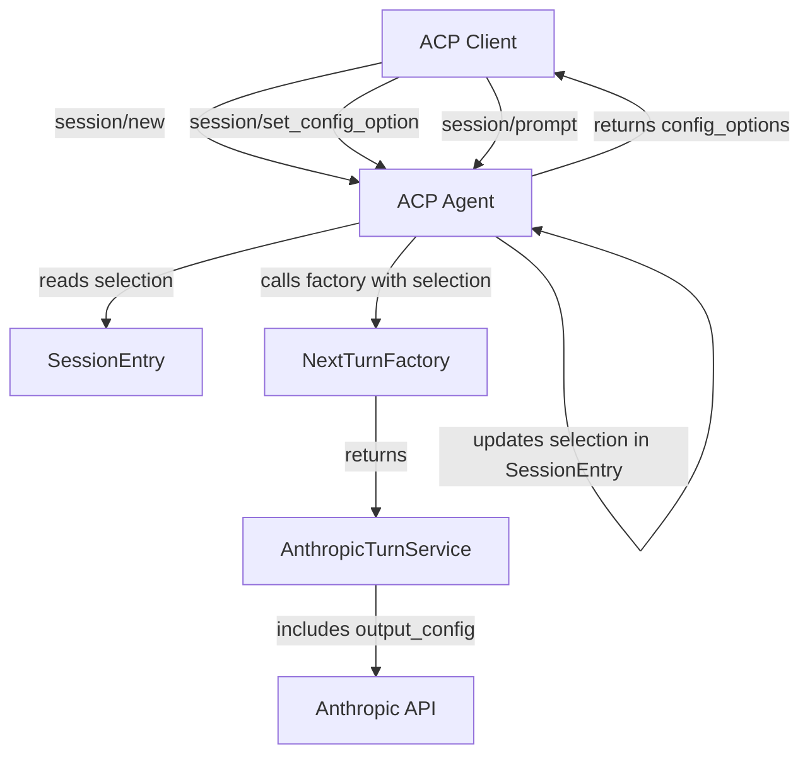

# Requirements

### Overview & Goals
The goal is to expose per-session selectors for **Model** and **Effort** to ACP clients (like Zed). This allows users to switch between different Claude models and control the "effort" level for reasoning-capable models (like Claude 3.7 Sonnet) directly from their client.

### Scope
- **In Scope**:
    - Adding `Effort` enum and support in `turn-anthropic`.
    - Creating a `selection` module in `acp-agent` to manage session options.
    - Implementing `session/set_config_option` in the ACP agent.
    - Persisting selection state in `SessionEntry`.
    - Updating the turn factory to be selection-aware.
    - Updating `cli-agent` to support the new factory signature.
- **Out of Scope**:
    - Threading selection through to subagents (they will use default settings).
    - Implementing non-Anthropic model support (catalog is limited to Claude models).

### User Stories
- As a user, I want to be able to select which Claude model to use for a session so that I can balance cost and performance.
- As a user, I want to be able to set the reasoning effort for models that support it so that I can get better results for complex tasks.
- As a client developer, I want to use standard ACP config options to expose model and effort selection to my users.


# Technical Design

### Current Implementation
- `NextTurnFactory` is a simple closure `Arc<dyn Fn() -> Arc<dyn NextTurnService>>`.
- `AnthropicConfig` is created once per factory and cloned for every turn.
- `SessionEntry` contains session state, cancellation tokens, and tools, but no mutable configuration.

### Proposed Changes

#### 1. `turn-anthropic` Enhancements
- Add `Effort` enum: `Low`, `Medium`, `High`.
- Add `effort: Option<Effort>` to `AnthropicConfig`.
- Update `build_body` to include `output_config: {"effort": ...}` when `effort` is `Some`.

#### 2. `acp-agent` Selection Module
- `ModelSelection` struct:
  ```rust
  pub struct ModelSelection {
      pub model: String,
      pub effort: Effort,
  }
  ```
- `MODEL_CATALOG`: list of supported model IDs and names.
- `apply_update`: validates and updates `ModelSelection`.
- `config_options`: generates `Vec<SessionConfigOption>` for the ACP response.

#### 3. Agent & Session State
- Update `NextTurnFactory` to `Arc<dyn Fn(&ModelSelection) -> Arc<dyn NextTurnService>>`.
- Add `selection: StdMutex<ModelSelection>` to `SessionEntry`.
- `session/new`: Populate `NewSessionResponse.config_options`.
- `session/set_config_option`: Update session's `ModelSelection` and return the new state.
- `session/prompt`: Read current `ModelSelection` and pass it to the factory.

#### 4. Wiring and Factories
- `anthropic_factory()`: Takes `&ModelSelection`, overrides `model` and `effort` in the cloned `AnthropicConfig`.
- `canned_replay_factory()`: Ignores the selection.
- `build_registry()`: Uses default selection for subagent factory.

### Architecture Diagram


### File Structure
- `crates/turn-anthropic/src/request.rs`: Added `Effort` enum and `AnthropicConfig` updates.
- `crates/acp-agent/src/selection.rs`: New module for model/effort management.
- `crates/acp-agent/src/config.rs`: Updated `AgentConfig`.
- `crates/acp-agent/src/agent.rs`: Updated `SessionEntry` and request handlers.
- `crates/acp-agent/src/lib.rs`: Updated factories and wiring.
- `crates/cli-agent/src/repl.rs`: Updated REPL loop to match factory signature.
- `crates/acp-agent/tests/config_options.rs`: New integration tests.


# Testing

### Validation Approach
Verification will be done via unit tests in each crate and a new end-to-end integration test in `acp-agent`.

### Key Scenarios
1. **Initial Session Config**: Verify `session/new` returns the default model and effort in `config_options`.
2. **Update Config**: Verify `session/set_config_option` updates the model/effort and returns the correct updated state.
3. **Invalid Config**: Verify `session/set_config_option` with unknown model ID or invalid value is rejected (ignored) and returns current state.
4. **Prompt with Config**: Verify that `session/prompt` uses the selected model and effort (verified via a spy factory in tests).
5. **Environment Fallback**: Verify `ANTHROPIC_MODEL` and `ANTHROPIC_EFFORT` correctly set the initial defaults.

### Test Changes
- **New Test**: `crates/acp-agent/tests/config_options.rs` will test the full ACP flow for configuration options.
- **Updated Tests**: `e2e_prompt.rs` and `mcp_session_wiring.rs` will be updated to accommodate the changed factory signature.


# Delivery Steps

###   Step 1: Update turn-anthropic to support effort selection
The `turn-anthropic` crate supports the Anthropic Messages API `effort` parameter.

- Implement `Effort` enum with `Low`, `Medium`, `High` variants in `crates/turn-anthropic/src/request.rs`.
- Update `AnthropicConfig` to include an optional `effort` field.
- Update `AnthropicConfig::from_env()` to read `ANTHROPIC_EFFORT`.
- Modify `build_body()` to include `output_config` in the request JSON when effort is specified.
- Export `Effort` in `crates/turn-anthropic/src/lib.rs`.
- Add unit tests for `Effort` roundtrip and `output_config` presence/absence.

###   Step 2: Implement selection module and update AgentConfig in acp-agent
The `acp-agent` crate has a new module for managing session configuration options.

- Create `crates/acp-agent/src/selection.rs` with `ModelSelection` struct and `MODEL_CATALOG`.
- Implement `ModelSelection::for_config`, `config_options`, and `apply_update` in the new module.
- Update `AgentConfig` in `crates/acp-agent/src/config.rs` to include `default_model` and read it from `ANTHROPIC_MODEL`.
- Add unit tests for `selection.rs` validating configuration option generation and updates.

###   Step 3: Wire selection state and handlers into the ACP agent
The ACP agent supports per-session model and effort selection via standard protocol requests.

- Update `NextTurnFactory` signature in `crates/acp-agent/src/agent.rs` to accept `&ModelSelection`.
- Add `selection: StdMutex<ModelSelection>` to `SessionEntry`.
- Update `session/new` handler to initialize selection and include `config_options` in the response.
- Implement `session/set_config_option` request handler.
- Update `session/prompt` to use the session's current selection when creating the turn service.
- Update `anthropic_factory`, `canned_replay_factory`, and `build_registry` in `crates/acp-agent/src/lib.rs` to match the new factory signature.

###   Step 4: Update CLI agent, existing tests, and add new integration tests
The CLI agent and existing tests are updated to match the new backend factory signature.

- Update `crates/cli-agent/src/repl.rs` to pass a default `ModelSelection` to the factory.
- Update `crates/acp-agent/tests/e2e_prompt.rs` and `crates/acp-agent/tests/mcp_session_wiring.rs` (and any other test files) to match the new `NextTurnFactory` signature.
- Create `crates/acp-agent/tests/config_options.rs` as a new integration test for session configuration options.
- Verify the changes with `cargo test`.