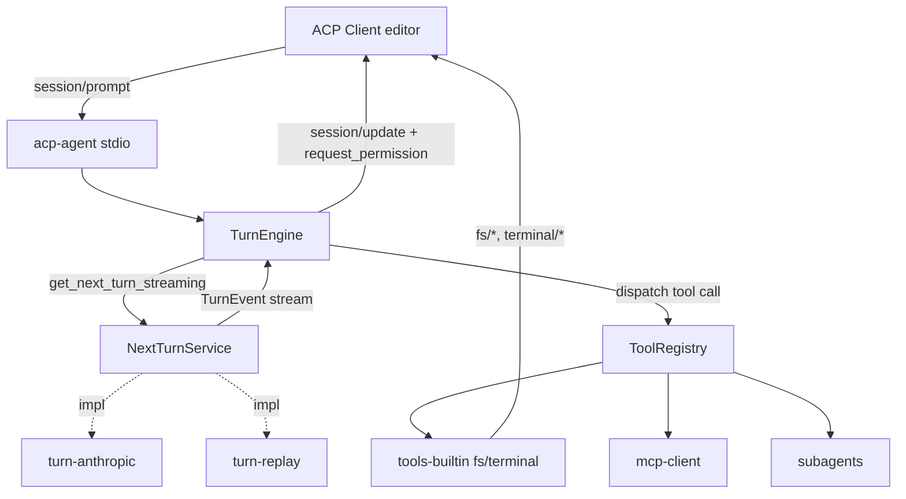
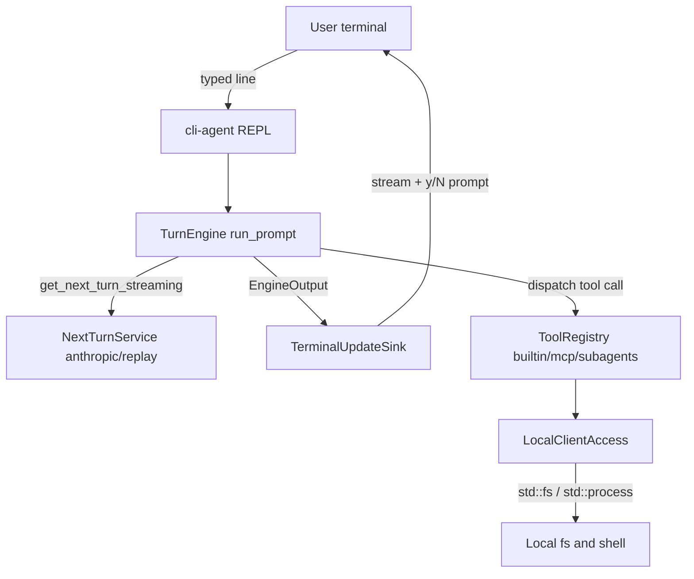
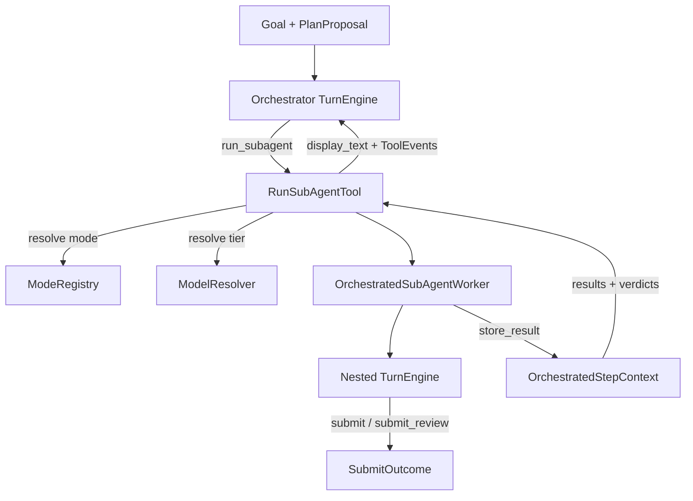
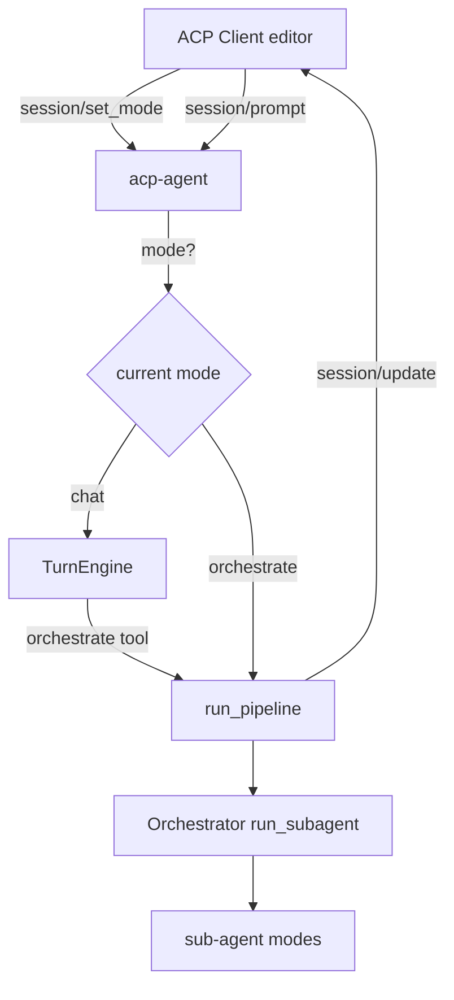
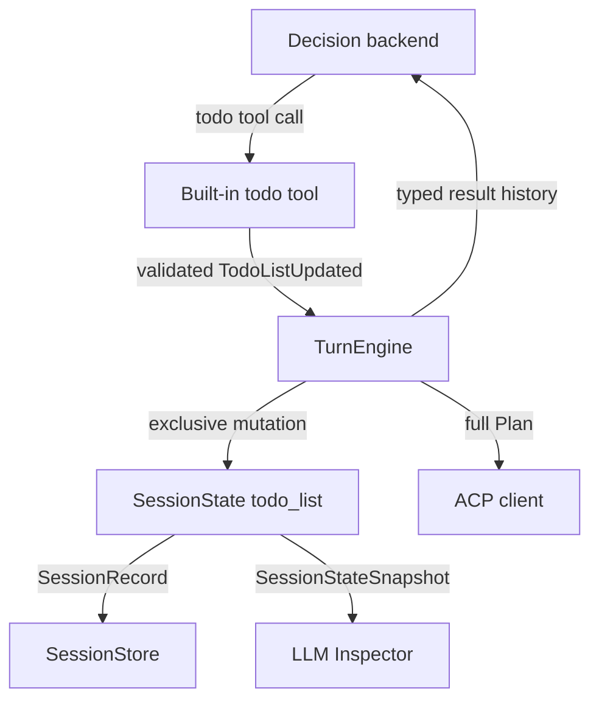
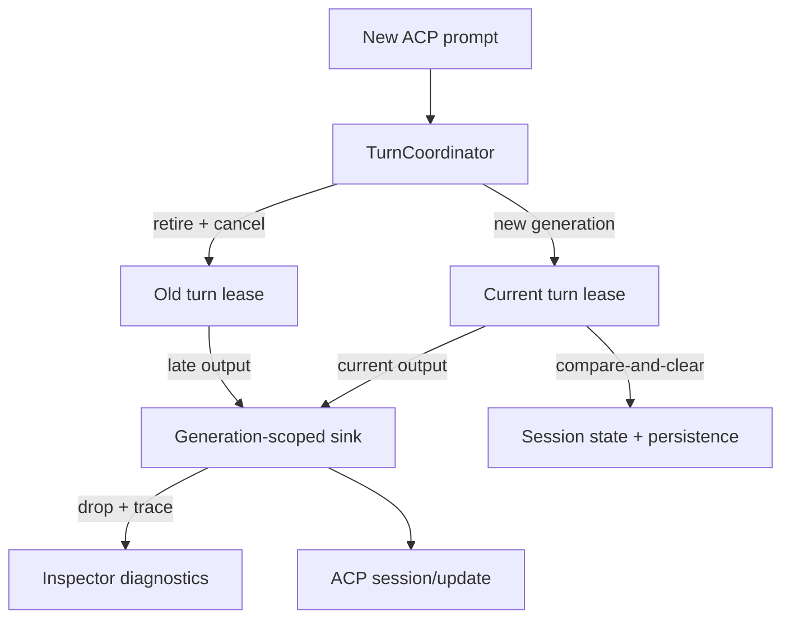
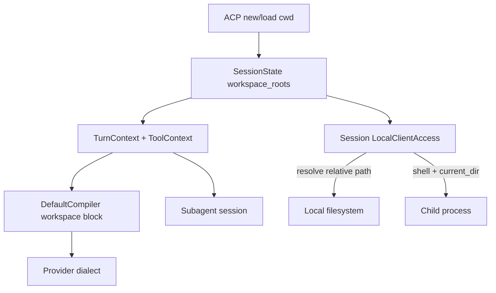

# Requirements

### Overview & Goals
Build a working **Agent Client Protocol (ACP)** agent in Rust that is **streaming-first**, **debuggable**, and **testable**. The agent connects to an ACP client (e.g. Zed, JetBrains) over **stdio** and answers prompts by driving a turn loop.

The central design principle is a clean separation between:
- the **decision layer** — an abstract `NextTurnService` (`get_next_turn_streaming`) that decides *what the agent does next* as a stream of events. Its concrete implementations are interchangeable: a real **Anthropic Messages API** backend, a deterministic **replay/recording** backend for tests, or scripted backends.
- the **services layer** — tools, MCP, subagents, ACP client access (fs/terminal), permissions — invoked by the turn engine in response to decision events.

The codebase is a **modular Cargo workspace**: each capability is its own crate behind a trait seam.

### Scope
**In Scope (v1)**
- ACP agent over **stdio** using the `agent-client-protocol` crate.
- Core methods: `initialize`, `authenticate` (no-op/passthrough), `session/new`, `session/prompt`, `session/cancel`.
- Streaming `session/update` output: `agent_message_chunk`, `plan`, `tool_call` / `tool_call_update`, and `session/request_permission`.
- `NextTurnService` abstraction with two implementations: **Anthropic** (real) and **replay** (deterministic, for tests/debugging).
- **Built-in tools**: filesystem read/write and terminal execution via ACP client methods.
- **MCP client**: connect to configured MCP servers and expose their tools in the turn loop.
- **Subagents**: a tool that spawns a nested agent turn (delegation).

**Out of Scope (v1)**
- Skills module (planned as a future pluggable module; trait seam left open).
- HTTP/WebSocket transport (stdio only for now).
- Multi-provider LLM backends beyond Anthropic (trait stays provider-agnostic to add later).
- Session persistence/resume, session list/delete.

### User Stories
- As an **editor user**, I send a prompt and see the agent's response stream token-by-token, with visible plan steps and tool activity.
- As an **editor user**, I am asked to grant/deny permission before destructive tool calls (file writes, terminal commands).
- As an **agent developer**, I can swap the real Anthropic backend for a recorded one and get fully deterministic, reproducible turn behavior in tests.
- As an **agent developer**, I can add a new tool, an MCP server, or a subagent as an isolated module without touching the turn engine.

### Functional Requirements
- The agent negotiates protocol version and advertises capabilities during `initialize`.
- On `session/prompt`, the agent runs a turn loop: decision events -> stream text to client -> execute tool calls -> feed results back -> repeat until a stop reason, then return the `session/prompt` response with a `stopReason`.
- Tool calls are surfaced as ACP `tool_call` updates with status transitions (pending -> in_progress -> completed/failed).
- Destructive tools request permission via `session/request_permission`; a denied permission aborts that tool call gracefully.
- `session/cancel` aborts in-flight LLM streaming and tool execution and returns a `cancelled` stop reason.

### Non-Functional Requirements
- **Streaming latency**: output chunks are forwarded to the client as they arrive, without buffering the full turn.
- **Testability**: the full turn loop is runnable without network via the replay backend and in-memory fake ACP client.
- **Debuggability**: structured `tracing` logs for every decision event, tool call, and ACP message; optional recording of turn event streams.
- **Modularity**: capability crates depend only on core trait definitions, not on each other.

# Technical Design

### Current Implementation
Greenfield project — the repository contains only IDE metadata (`rust-agent.iml`, `.idea/`) and no Rust sources yet. The design builds on the official [`agent-client-protocol`](https://crates.io/crates/agent-client-protocol) crate (v1.x), which provides the `Agent`/`Client` traits, JSON-RPC transport, and ACP schema types.

### Key Decisions
- **Decision layer = `NextTurnService`, not "LLM service"** — the abstraction represents *what the agent does next* as an event stream. Anthropic is just one implementation; replay/scripted are equal-class implementations. Rationale: keeps the turn engine provider-agnostic and fully testable.
- **Central `TurnEngine` + single event stream** (chosen over actor/channel pipeline) — the engine drives the loop, consumes a `Stream<TurnEvent>` from `NextTurnService`, dispatches tool calls, and maps everything to ACP `session/update`. Rationale: simplest streaming-first model, easy to follow and test.
- **Cargo workspace, multiple crates** (chosen over single crate) — strong module boundaries and independent testing per capability.
- **Anthropic Messages API** as the real backend, consumed as native SSE streaming with tool-use blocks.
- **stdio transport** only for v1.

### Proposed Changes
Create a Cargo workspace with capability crates that depend on `agent-core` trait definitions only.

**Core abstractions (`agent-core`):**
```rust
// The decision layer: what does the agent do next?
#[async_trait]
pub trait NextTurnService: Send + Sync {
    async fn get_next_turn_streaming(
        &self,
        ctx: &TurnContext,      // conversation history, available tools, system prompt
    ) -> Result<BoxStream<'static, TurnEvent>>;
}

// Streaming decision events (provider-agnostic)
pub enum TurnEvent {
    TextDelta(String),
    Thinking(String),
    Plan(PlanUpdate),
    ToolCallRequested { id: ToolCallId, name: String, arguments: serde_json::Value },
    TurnFinished { stop_reason: StopReason },
    Error(TurnError),
}

// The services layer: a callable capability
#[async_trait]
pub trait Tool: Send + Sync {
    fn name(&self) -> &str;
    fn schema(&self) -> serde_json::Value;      // JSON schema for arguments
    fn requires_permission(&self) -> bool;
    async fn call(&self, args: serde_json::Value, ctx: &ToolContext)
        -> Result<BoxStream<'static, ToolEvent>>;
}

pub struct ToolRegistry { /* name -> Arc<dyn Tool> */ }
```

**Turn engine (`agent-core`):**
```rust
pub struct TurnEngine {
    next_turn: Arc<dyn NextTurnService>,
    tools: ToolRegistry,
}
impl TurnEngine {
    // Runs the loop until a stop reason; emits EngineOutput items that the ACP
    // layer maps to session/update notifications.
    pub async fn run_prompt(
        &self, session: &mut SessionState, sink: &mut dyn UpdateSink,
    ) -> Result<StopReason>;
}
```
Loop: call `get_next_turn_streaming` -> forward `TextDelta`/`Plan` to `sink` -> on `ToolCallRequested`, look up the tool, request permission if needed, execute, stream `ToolEvent`s as `tool_call_update`, append the result to `SessionState` history -> repeat until `TurnFinished`.

**ACP binding (`acp-agent` binary):** implements the `agent-client-protocol` `Agent` trait; `initialize`/`session/new` set up `SessionState`; `session/prompt` constructs a `TurnEngine`, wires an `UpdateSink` that emits `session/update`, and drives `run_prompt`; `session/cancel` triggers a cancellation token consumed by both the decision stream and tool execution.

### Data Models / Contracts
- `SessionState`: session id, workspace roots, message history (user/assistant/tool turns), available tool descriptors.
- `TurnContext`: immutable view of history + tool schemas + system prompt passed to `NextTurnService`.
- `ToolContext`: access to the ACP `Client` handle (for `fs/*`, `terminal/*`), session id, cancellation token.
- `UpdateSink`: trait mapping engine output to ACP `session/update` (kept abstract so tests use an in-memory sink).

### Components
- **`agent-core`** — traits (`NextTurnService`, `Tool`, `UpdateSink`), `TurnEngine`, event model, `SessionState`, `ToolRegistry`.
- **`turn-anthropic`** — `NextTurnService` impl over Anthropic Messages API streaming (SSE -> `TurnEvent`).
- **`turn-replay`** — deterministic `NextTurnService` impl replaying a recorded/scripted `Vec<TurnEvent>` for tests & debugging.
- **`tools-builtin`** — `fs_read`, `fs_write`, `terminal_run` tools implemented via the ACP `Client` methods.
- **`mcp-client`** — connects to configured MCP servers, wraps each MCP tool as a `Tool`.
- **`subagents`** — a `Tool` that instantiates a nested `TurnEngine` (with its own `NextTurnService`) to handle delegated sub-tasks and streams progress back.
- **`acp-agent`** — binary: stdio transport, `Agent` trait impl, config loading, `tracing` setup.

### File Structure
```
Cargo.toml                # workspace
crates/
  agent-core/             # traits, TurnEngine, events, session state
  turn-anthropic/         # Anthropic NextTurnService impl
  turn-replay/            # deterministic replay NextTurnService
  tools-builtin/          # fs + terminal tools
  mcp-client/             # MCP integration
  subagents/              # subagent delegation tool
  acp-agent/              # binary: stdio ACP server
```

### Architecture Diagram


### Risks
- **Anthropic SSE mapping**: tool-use block streaming and partial JSON arguments must be assembled correctly before dispatch — mitigate with a dedicated parser tested against recorded fixtures.
- **Cancellation correctness**: a single `CancellationToken` must reach both the decision stream and running tools/subagents to avoid orphaned work.
- **Subagent recursion**: guard against unbounded nesting with a depth limit in `ToolContext`.
- **Permission race**: tool execution must not start before permission is granted; enforce in `TurnEngine` before `Tool::call`.

# Testing

### Validation Approach
Because the `NextTurnService` is an abstraction, the entire turn loop is validated deterministically without network access using the **`turn-replay`** backend plus an **in-memory fake ACP client/`UpdateSink`**. Real integration with Anthropic is validated separately behind an ignored/gated test.

### Key Scenarios
- **Plain streaming turn**: replay a `TextDelta` sequence -> assert the fake sink received matching `agent_message_chunk` updates in order and a correct final `stopReason`.
- **Single tool call**: replay `ToolCallRequested` for `fs_read` -> assert `tool_call` (pending->in_progress->completed) updates and that the tool result is appended to history and fed into the next decision call.
- **Permission flow**: a destructive `fs_write`/`terminal_run` triggers `session/request_permission`; test both granted (executes) and denied (tool call marked failed, loop continues).
- **MCP tool**: with a stub MCP server, assert an MCP-provided tool is discoverable and callable through the same `Tool` path.
- **Subagent delegation**: replay a `ToolCallRequested` for the subagent tool -> assert a nested turn runs and its output streams back as tool updates.

### Edge Cases
- **Cancellation mid-stream**: fire `session/cancel` during a long replay stream and during tool execution -> assert prompt returns `cancelled` and no further updates are emitted.
- **Malformed tool arguments**: decision emits invalid JSON args -> tool call fails gracefully with an error update, loop is not deadlocked.
- **Unknown tool name**: engine returns a structured error result to the decision layer instead of panicking.
- **Subagent depth limit** exceeded -> delegation refused with an error tool result.
- **Anthropic SSE parsing** unit tests against recorded raw SSE fixtures (partial tool-use JSON, interleaved text/thinking).

### Test Changes
- Unit tests colocated in each crate (`#[cfg(test)]`).
- `agent-core` integration tests using `turn-replay` + fake `UpdateSink`.
- Anthropic live test marked `#[ignore]`, run manually with an API key.

# Terminal CLI

### Overview & Goals
Add a **simple interactive terminal chat** so the agent can be run and used directly from a shell — no editor/ACP client required. You launch the binary, it prints a prompt, you type a message, and the assistant's answer streams back inline. It reuses the exact same turn machinery (`TurnEngine`, `NextTurnService`, `ToolRegistry`) as the ACP server; only the presentation (an `UpdateSink`) and the tool-backing client (`ClientAccess`) differ.

### Key Decisions
- **New `cli-agent` binary crate** — a thin front-end over the existing `agent-core` machinery, mirroring how `acp-agent` wires things. Rationale: keeps the ACP server untouched and follows the established modular crate boundaries.
- **Line-based REPL** (chosen over a full-screen ratatui TUI) — read a line from stdin, stream the answer to stdout, repeat. Rationale: user asked for a *simple* terminal UI; no extra TUI dependency, trivially testable.
- **Local direct execution for tools** — a `LocalClientAccess` implements `ClientAccess` against the real machine (`std::fs`, `std::process::Command`) since there is no editor to serve `fs/*` and `terminal/*`. Rationale: makes the built-in fs/terminal tools actually work from the CLI.
- **Same backend selection as `acp-agent`** — reuse `default_deps()`/`anthropic_factory()`/`canned_replay_factory()` so the CLI uses Anthropic when a key resolves (env or `token.properties`) and falls back to the deterministic replay backend otherwise.
- **Permission prompts on stdin** — the CLI `UpdateSink::request_permission` asks the user `[y/N]` inline before destructive tool calls.

### Current Implementation
The reusable wiring already exists in `acp-agent`'s library: `AgentConfig`, `NextTurnFactory`, `build_registry`, `default_deps`, plus the `TurnEngine::run_prompt(session, sink, cancel)` loop in `agent-core`. The `UpdateSink` and `ClientAccess` traits are the two seams the CLI must implement. `EngineOutput` variants (`MessageChunk`, `ThinkingChunk`, `Plan`, `ToolCall`, `ToolCallUpdate`) are what the terminal sink renders.

### Proposed Changes
- **`crates/cli-agent`** (new binary):
  - `main.rs` — set up `tracing` (to stderr, so it does not corrupt the chat on stdout), build deps, run the REPL loop.
  - `repl.rs` — read stdin lines; on each non-empty line append a user message to a persistent `SessionState` and call `TurnEngine::run_prompt`; handle `Ctrl-D`/`exit`/`quit` to terminate and `Ctrl-C` to cancel the in-flight turn via the `CancellationToken`.
  - `sink.rs` — `TerminalUpdateSink` implementing `UpdateSink`: print `MessageChunk`/`ThinkingChunk` incrementally (flushing stdout), render `ToolCall`/`ToolCallUpdate` as concise status lines, and implement `request_permission` as an inline `[y/N]` stdin prompt.
  - `local_client.rs` — `LocalClientAccess` implementing `ClientAccess` with `std::fs` reads/writes and `std::process::Command` execution (mapping output/exit code into `TerminalOutcome`).
- **Conversation continuity** — keep a single `SessionState` across REPL iterations so the chat has memory within a run.
- **Workspace** — add `cli-agent` to the root `Cargo.toml` members.

### File Structure
```
crates/
  cli-agent/              # NEW binary: interactive terminal chat
    src/
      main.rs             # tracing + deps + REPL bootstrap
      repl.rs             # stdin loop, cancellation, exit handling
      sink.rs             # TerminalUpdateSink (streaming + permission prompt)
      local_client.rs     # LocalClientAccess (std::fs / std::process)
```

### Architecture Diagram


### Risks
- **stdout interleaving**: streamed chunks and the `[y/N]` prompt share stdout; flush carefully and print permission prompts on their own line.
- **Cancellation via Ctrl-C**: a signal handler must trip the `CancellationToken` without killing the process, so the REPL survives a cancelled turn.
- **Blocking stdin vs async engine**: read input on a blocking task (`spawn_blocking` or a dedicated thread) so it does not stall the async runtime.

# Orchestration Requirements

### Overview & Goals
Add an **orchestrated execution** capability (per `docs/design/orchestrated-execution.md`) as a new `orchestrated` crate. A top-level **orchestrator LLM** receives a Goal and a `PlanProposal` and drives the work through an **un-fixed pipeline** by repeatedly calling a single tool, `run_subagent(mode, step_index, instructions?, scope?, model_tier?)`. The orchestrator never does the work itself — every implementation, review, and planning action is delegated to a **sub-agent** run in a specific **mode**.

The feature must be **scalable, observable, well-typed, testable, thread-safe, and not error-prone**, reusing the existing streaming-first seams (`TurnEngine`, `NextTurnService`, `Tool`/`ToolRegistry`, `UpdateSink`, `CancellationToken`) without modifying `agent-core`.

### Scope
**In Scope**
- New `orchestrated` crate with: `SubAgentMode` contract + families (Executor: `code`/`setup`/`niche`; Reviewer: `review`/`review_plan`; Planner: `plan`), a mode registry, the `run_subagent` tool, the sub-agent worker, and the orchestrator assembly.
- `OrchestratedStepContext` (already started) as the shared state passing results/verdicts between modes, keyed by `(mode_id, step_index)`, with attempt counters and the current `PlanProposal`.
- Model-tier resolution (`low`/`medium`/`high`) and escalation, provider-neutral via an injected resolver.
- Preconditions (e.g. `review` requires a prior executor result for the step; `review_plan` requires a planner result), retries, and structured reviewer verdicts.
- Streaming progress of each sub-agent run back through the orchestrator's turn as ordinary tool updates; `tracing` spans for observability.
- Deterministic tests using the `turn-replay` backend for both orchestrator and sub-agents.

**Out of Scope**
- Changes to `agent-core` trait definitions (the tool captures its own state; core stays untouched).
- Persisting orchestration state across process restarts.
- A dedicated ACP/CLI "orchestrated" front-end UX beyond a wiring toggle (basic wiring only).

### User Stories
- As an **agent developer**, I give the orchestrator a Goal + plan and it autonomously sequences implement/review/re-implement passes, deciding order and pass count itself.
- As an **agent developer**, I can add a new sub-agent mode as an isolated module implementing `SubAgentMode` without touching the orchestrator or the turn engine.
- As an **agent developer**, I can run the entire orchestration deterministically in tests via replay backends, asserting results/verdicts flow correctly between modes.
- As an **operator**, I can observe (via `tracing`) which mode/step/attempt is running and its outcome.

### Functional Requirements
- `run_subagent` parses `mode` (via `SubAgentMode::from_str`) and 1-based `step_index` (converted to 0-based), validates preconditions, records the attempt, resolves the model tier (honoring escalation or a mode's fixed model), runs the sub-agent to a stop reason, stores the `StepResult`, and returns a concise `display_text` to the orchestrator.
- Reviewer modes report success via a structured submit tool (`submit_review`), not text parsing; executors use a plain `submit`.
- A denied precondition or a refused delegation fails the tool call gracefully (a `Failed` tool result), never panics, and the orchestrator loop continues.
- Cancellation propagates from the orchestrator turn into the running sub-agent via the shared `CancellationToken`.

### Non-Functional Requirements
- **Thread-safety**: shared state guarded by `Mutex`; guards are never held across `.await`.
- **Observability**: a `tracing` span per `run_subagent` carrying `mode`, `step_index`, `attempt`, and outcome.
- **Testability**: orchestrator and sub-agents both driven by `turn-replay`; no network in unit/integration tests.
- **Modularity**: `orchestrated` depends only on `agent-core` (plus `turn-replay` as a dev-dependency).

# Orchestration Design

### Current Implementation
The `orchestrated` crate currently contains only `context.rs`: `ModelTier` (with `escalated()`/`from_str_opt`), `PlanStepSpec`, `PlanProposal` (with `render()`), `StepResult`, and `OrchestratedStepContext` (proposal + `(mode_id, step_index)`-keyed results + attempt counters, all `Mutex`-guarded). The reusable turn machinery lives in `agent-core` (`TurnEngine::run_prompt(session, sink, cancel)`, `NextTurnService`, `Tool`/`ToolRegistry`, `UpdateSink`, `ToolContext`). The `subagents` crate is the template: a `Tool` that spawns a nested `TurnEngine` with a `CapturingSink` and enforces a depth limit.

### Key Decisions
- **`SubAgentMode` trait + shared behavior structs** (chosen over a data-driven `ModeSpec`) — each mode is its own struct delegating to a shared `ExecutorBehavior`/`ReviewerBehavior`/`PlannerBehavior` via composition, mirroring the reference. Rationale: independently testable modes, easy to add new ones, no giant branch.
- **Per-mode submit action for verdicts** (chosen over parsing final text) — executors inject a `submit` tool; reviewers inject a structured `submit_review { approved, reasons }`. Success is read from the structured result. Rationale: typed, explicit, robust to phrasing.
- **`run_subagent` state captured in the tool struct** (chosen over extending `ToolContext`) — `RunSubAgentTool` owns `Arc<OrchestratedStepContext>`, the `ModeRegistry`, and a model resolver + worker factory; `agent-core` stays unchanged. Rationale: keeps orchestration self-contained in its crate.
- **Provider-neutral model resolution** — an injected `ModelResolver` (or `Fn(ModelTier) -> Arc<dyn NextTurnService>`) maps a tier to a decision backend, so escalation stays provider-agnostic.
- **Orchestrator is just a `TurnEngine`** whose registry contains only `run_subagent`, driven by its own `NextTurnService` and an orchestrator system prompt — no new engine type needed.

### Proposed Changes
**Mode contract (`mode.rs`):**
```rust
#[async_trait]
pub trait SubAgentMode: Send + Sync {
    fn id(&self) -> &str;
    fn orchestrator_kind(&self) -> OrchestratorKind;      // Executor | Reviewer | Planner
    fn is_plan_creation_mode(&self) -> bool { false }
    fn supports_retry(&self) -> bool;
    fn supports_model_escalation(&self) -> bool;
    fn fixed_model(&self) -> Option<ModelTier> { None }
    fn initial_max_steps(&self) -> usize;
    fn retry_max_steps(&self) -> usize;

    fn system_prompt(&self, ctx: &OrchestratedStepContext, step_index: usize) -> String;
    fn tool_capabilities(&self, base: &ToolRegistry) -> ToolRegistry;   // filter/extend
    fn submit_action(&self) -> Arc<dyn Tool>;                            // submit | submit_review
    fn build_issue_description(&self, req: &SubAgentRequest, step: Option<&PlanStepSpec>) -> String;
    fn build_pre_chat_observations(&self, ctx: &OrchestratedStepContext, step_index: usize) -> String;
    fn check_preconditions(&self, ctx: &OrchestratedStepContext, step_index: usize) -> Result<(), PreconditionError>;
    fn parse_success(&self, submit: &SubmitOutcome) -> bool;
    fn compress_result(&self, submit: &SubmitOutcome) -> String;
    fn display_text(&self, output: &str) -> String;
}
```
Shared behavior structs (`ExecutorBehavior`, `ReviewerBehavior`, `PlannerBehavior`) implement the common policy; concrete `data`-like mode structs (`CodeMode`, `SetupMode`, `NicheMode`, `ReviewMode`, `ReviewPlanMode`, `PlanMode`) hold an `Arc<Behavior>` and only override `id`/prompt-prefix/model specifics.

**Mode registry (`registry.rs`):** `ModeRegistry` maps `id -> Arc<dyn SubAgentMode>` with `from_str(mode)` returning a structured error for unknown modes.

**Submit actions (`submit.rs`):** `SubmitTool` and `SubmitReviewTool` implement `Tool`; they write a `SubmitOutcome` into a per-run shared slot (`Arc<Mutex<Option<SubmitOutcome>>>`) that the worker reads after the nested turn finishes.

**Sub-agent worker (`worker.rs`):** `OrchestratedSubAgentWorker` builds a nested `SessionState` (system prompt + issue description + pre-chat observations), constructs a `TurnEngine` with the mode's `tool_capabilities` (+ its submit action) and the tier-resolved `NextTurnService`, runs it to a stop reason with a `CapturingSink`, then computes success via `parse_success`.

**`run_subagent` tool (`action.rs`):** `RunSubAgentTool` (implements `Tool`) captures `Arc<OrchestratedStepContext>`, the `ModeRegistry`, and a `ModelResolver`; its `call` performs the 10-step flow from the reference (parse -> preconditions -> attempt -> resolve model/escalation -> worker run -> `store_result` -> stream progress -> return `display_text`), emitting `ToolEvent`s and a `tracing` span.

**Orchestrator assembly (`lib.rs`):** a builder that constructs the orchestrator `TurnEngine` (registry = only `run_subagent`) plus a default `ModeRegistry`, ready to be wired into `acp-agent`/`cli-agent` behind a toggle.

### Data Models / Contracts
- `SubAgentRequest { mode, step_index, instructions: Option<String>, scope: Option<String>, model_tier: Option<ModelTier> }` — parsed from `run_subagent` args.
- `SubmitOutcome { success: bool, output: String, reasons: Option<String> }` — written by submit tools, read by the worker.
- `OrchestratorKind { Executor, Reviewer, Planner }`.
- `ModelResolver: Fn(ModelTier) -> Arc<dyn NextTurnService>` (or a small trait) — injected, provider-neutral.
- Reuses `StepResult`, `PlanProposal`, `ModelTier` from `context.rs`.

### Components
- **`orchestrated::context`** — shared state (exists).
- **`orchestrated::mode`** — `SubAgentMode` trait + behavior structs + concrete modes.
- **`orchestrated::registry`** — `ModeRegistry`, `from_str`.
- **`orchestrated::submit`** — `SubmitTool`, `SubmitReviewTool`, `SubmitOutcome`.
- **`orchestrated::worker`** — nested-engine runner (built on the `subagents` pattern).
- **`orchestrated::action`** — `RunSubAgentTool`.
- **`orchestrated` (lib)** — orchestrator builder + `ModelResolver` seam; optional wiring into `acp-agent`/`cli-agent`.

### File Structure
```
crates/
  orchestrated/
    src/
      context.rs      # shared state (EXISTS)
      mode.rs         # SubAgentMode trait + behaviors + modes
      registry.rs     # ModeRegistry + from_str
      submit.rs       # SubmitTool / SubmitReviewTool / SubmitOutcome
      worker.rs       # OrchestratedSubAgentWorker (nested TurnEngine)
      action.rs       # RunSubAgentTool (the run_subagent tool)
      lib.rs          # re-exports + orchestrator builder + ModelResolver
```

### Architecture Diagram


### Risks
- **State lifetime across nested turns**: submit slot and `OrchestratedStepContext` are shared via `Arc<Mutex<..>>`; never hold a guard across `.await`.
- **Precondition ordering**: `review` before an executor result must fail cleanly — enforced in `check_preconditions` and surfaced as a `Failed` tool result.
- **Escalation loops**: bound retries/attempts; the orchestrator LLM decides passes, but the tool caps `max_steps` per attempt and clamps `ModelTier::escalated()` at `High`.
- **Cancellation**: the shared token must reach the nested engine so a cancelled orchestrator turn stops in-flight sub-agents.

# Orchestration Testing

### Validation Approach
Drive both the orchestrator and every sub-agent with `turn-replay`, so an entire Goal -> implement -> review -> re-implement flow runs deterministically with no network. Assert on `OrchestratedStepContext` state (stored results, attempts, verdicts) and on the streamed `ToolEvent`s / `display_text`.

### Key Scenarios
- **Single executor pass**: `run_subagent(mode=code, step_index=1)` runs a nested turn, stores a `StepResult`, returns `display_text`.
- **Implement -> review (approved)**: an executor result then `review` with a `submit_review{approved:true}` -> stored positive verdict, precondition satisfied.
- **Review before implement**: `review` with no prior executor result -> precondition fails gracefully (Failed tool result), no panic.
- **Escalation/retry**: a failed executor pass, then a retry with `model_tier=high` -> attempt counter increments and the higher tier resolves via `ModelResolver`.
- **Planner mode**: `plan` produces a `PlanProposal` stored into the context; `review_plan` requires it.

### Edge Cases
- **Unknown mode** -> `from_str` error surfaced as a Failed tool result.
- **Malformed args** (missing `mode`/`step_index`) -> graceful failure.
- **Cancellation mid sub-agent** -> orchestrator returns without emitting further updates.
- **Escalation clamp** at `High`.

### Test Changes
- Unit tests colocated per module (`mode`, `registry`, `submit`, `worker`, `action`).
- Integration test in `orchestrated/tests/` driving the orchestrator + sub-agents via replay through a full multi-pass flow.

# Orchestration Mode Integration

### Overview & Goals
Make the already-implemented `orchestrated` capability **actually reachable at runtime** in the ACP agent. Today the `Orchestrator` is only built inside tests; the `ACP_ORCHESTRATED` flag is read but never used to construct an orchestrator, so the editor cannot use it.

This adds **two complementary integration points**:
1. A **dedicated ACP session mode** (`orchestrate`) advertised via the native ACP session-mode mechanism, so an editor user can explicitly switch the session into orchestrated execution.
2. An **`orchestrate` tool** the ordinary chat agent can call itself, so the agent can *autonomously decide* to launch the orchestration pipeline for a goal — the same way it can already delegate via `subagents`.

Both are thin front-ends over a **single shared `run_pipeline` helper** in the `orchestrated` crate, so behavior stays identical however orchestration is triggered.

### Scope
**In Scope**
- Advertise ACP session modes on `session/new`: `chat` (default) and `orchestrate`, via `NewSessionResponse.modes` (`SessionModeState`).
- Handle the `session/set_mode` request (`SetSessionModeRequest`) to switch a session's current mode; persist it on the `SessionEntry`.
- Branch `session/prompt` on the current mode: `chat` -> existing `TurnEngine`; `orchestrate` -> run the orchestration pipeline, streaming through the same `AcpUpdateSink`.
- A reusable `run_pipeline(goal, backend, resolver, base_tools, sink, cancel)` entry point in the `orchestrated` crate that builds an `Orchestrator` and drives it to a `StopReason`.
- An `OrchestrateTool` (`orchestrate { goal }`) registered in the chat tool registry that invokes `run_pipeline` and streams sub-agent progress back as tool updates.
- A `ModelResolver` that maps **all tiers** (`Low`/`Medium`/`High`) to the single configured backend factory (Anthropic-or-replay), matching the chat backend.
- Seed the orchestrator context with a **single implicit plan step derived from the goal** so `code`/`review` modes work immediately; the orchestrator may still call the `plan` mode to refine.
- Wire the same integration into `cli-agent` (a `/orchestrate <goal>` command or mode toggle) reusing `run_pipeline`.

**Out of Scope**
- Auto-populating a rich multi-step `PlanProposal` from free-form planner text (known gap; the single implicit step is the v1 seed).
- Per-tier distinct Anthropic model ids (all tiers map to one backend for now; the resolver seam stays open for later).
- New MCP/HTTP transports.

### User Stories
- As an **editor user**, I switch the session to the `orchestrate` mode from the client's mode menu and my next prompt is handled by the orchestrator pipeline, with each sub-agent's progress streaming back.
- As an **editor user**, I stay in `chat` mode and the agent itself decides a task is big enough to call the `orchestrate` tool, then reports the orchestrated result.
- As an **operator**, orchestration triggered either way runs the exact same pipeline (shared `run_pipeline`), so behavior and logs are consistent.

### Functional Requirements
- `initialize` continues to negotiate version/capabilities; `session/new` returns `modes` with `current_mode_id = "chat"` and both modes listed.
- `session/set_mode` updates the stored current mode for the session and responds with `SetSessionModeResponse`; an unknown mode id is rejected with an error.
- In `orchestrate` mode, `session/prompt` treats the prompt text as the **goal**, runs `run_pipeline`, and returns a mapped `stopReason`; `session/cancel` cancels the orchestrator and its in-flight sub-agents via the shared `CancellationToken`.
- The `orchestrate` tool (chat mode) accepts `{ goal }`, runs the same pipeline nested within the current turn, streams `ToolEvent` progress, and returns a concise summary to the decision layer.
- The old `ACP_ORCHESTRATED` env flag becomes the **default initial mode** selector (when set, `session/new` advertises `orchestrate` as `current_mode_id`), preserving backward compatibility.

# Orchestration Mode Design

### Current Implementation
`crates/acp-agent/src/agent.rs` builds the `Agent` connection with handlers for `initialize`, `authenticate`, `session/new`, `session/prompt`, `session/cancel`. `SessionEntry` holds `state`, a `cancel` token, and a per-session `tools` registry. `session/prompt` spawns a task that builds a `TurnEngine::new(next_turn, tools).with_client(AcpClientAccess)` and drives `run_prompt` into an `AcpUpdateSink`. The `orchestrated` crate already provides `OrchestratorBuilder`/`Orchestrator` (a `TurnEngine` whose only tool is `run_subagent`), `ModeRegistry::with_defaults()`, a `ModelResolver` trait + `FnModelResolver`, and `OrchestratedStepContext`/`PlanProposal`. `acp-agent` exposes `default_deps()`, `anthropic_factory()`, `canned_replay_factory()`, and `build_registry()`. The ACP schema (v1.4) provides `SessionModeState`, `SessionMode`, `SessionModeId`, `SetSessionModeRequest`/`Response`, and `NewSessionResponse::modes(...)`.

### Key Decisions
- **Native ACP session modes** (chosen over an env-only toggle) — advertise `chat`/`orchestrate` in `NewSessionResponse.modes` and handle `session/set_mode`, so the editor exposes the switch in its UI. Rationale: this is the protocol-standard way to offer distinct agent behaviors per session.
- **Orchestration also exposed as an `orchestrate` tool** (per user request) — the chat agent can autonomously launch the pipeline mid-turn, mirroring the existing `SubagentTool` pattern. Rationale: lets the model itself reach the decision to orchestrate without a manual mode switch.
- **One shared `run_pipeline` helper** — both the mode branch and the tool call the same function, so there is a single source of truth for building/driving the orchestrator. Rationale: avoids divergence between the two entry points.
- **All model tiers map to the configured backend** — a resolver returns the same `next_turn_factory()` for every `ModelTier`, matching the chat backend (Anthropic when a key resolves, else replay). Rationale: keeps v1 wiring simple; the tier seam remains for future per-tier models.
- **Single implicit plan step seeded from the goal** — the orchestrator context starts with a one-step `PlanProposal` built from the prompt so `code`/`review` work without a planning pass; the `plan` mode can still refine it. Rationale: avoids the known plan-population gap blocking any useful run.

### Proposed Changes
**`orchestrated` crate — shared entry point:**
```rust
/// Build a ModelResolver that maps every tier to one backend factory.
pub fn uniform_resolver(
    factory: Arc<dyn Fn() -> Arc<dyn NextTurnService> + Send + Sync>,
) -> Arc<dyn ModelResolver>;

/// Build and drive an orchestrator for `goal`, streaming into `sink`.
pub async fn run_pipeline(
    goal: &str,
    orchestrator_backend: Arc<dyn NextTurnService>,
    resolver: Arc<dyn ModelResolver>,
    base_tools: ToolRegistry,
    sink: &mut dyn UpdateSink,
    cancel: &CancellationToken,
) -> Result<StopReason>;
```
`run_pipeline` seeds `OrchestratedStepContext` with a single `PlanStepSpec` derived from `goal`, calls `OrchestratorBuilder::new(backend, resolver).with_base_tools(base_tools).with_context(ctx).build()`, then `orch.engine().run_prompt(&mut orch.new_session(goal), sink, cancel)`.

**`orchestrated` crate — the tool:**
```rust
pub struct OrchestrateTool { /* backend factory, resolver, base tools */ }
impl Tool for OrchestrateTool {
    fn name(&self) -> &str { "orchestrate" }          // { goal: string }
    fn requires_permission(&self) -> bool { false }
    // call: build a CapturingSink, run_pipeline(goal, ...), stream progress
}
```
Modeled on `subagents::SubagentTool`: it runs the pipeline nested in the current turn and forwards progress as `ToolEvent`s.

**`acp-agent` changes:**
- `SessionEntry` gains `mode: StdMutex<SessionModeId>` (default `chat`).
- `session/new`: attach `NewSessionResponse::modes(SessionModeState::new("chat", vec![chat_mode, orchestrate_mode]))`; honor `ACP_ORCHESTRATED` as the initial `current_mode_id`.
- New handler for `SetSessionModeRequest`: validate + store the mode on the entry, respond `SetSessionModeResponse`.
- `session/prompt`: read the entry's mode; for `chat` keep today's `TurnEngine` path; for `orchestrate` call `orchestrated::run_pipeline(goal=user_text, backend=factory(), resolver=uniform_resolver(factory), base_tools=entry.tools, sink, cancel)`.
- `AgentDeps` gains the `next_turn_factory` (already present) reused to build the resolver; optionally register `OrchestrateTool` into the base registry in `build_registry` behind a config flag.

**`cli-agent` changes:** add a `/orchestrate <goal>` REPL command (and/or a mode toggle) that calls `run_pipeline` with `LocalClientAccess`-backed tools and the `TerminalUpdateSink`.

### Data Models / Contracts
- ACP: `SessionModeState { current_mode_id, available_modes: [SessionMode{ id, name, description }] }`; `SetSessionModeRequest { session_id, mode_id }` -> `SetSessionModeResponse`.
- `SessionEntry.mode: SessionModeId` — the per-session selected mode.
- `run_pipeline(...) -> Result<StopReason>` — the single shared driver.
- `OrchestrateTool` args: `{ "goal": string }`.
- Reuses `Orchestrator`, `ModeRegistry`, `ModelResolver`, `OrchestratedStepContext`, `PlanProposal`, `PlanStepSpec`.

### Components
- **`orchestrated` (lib)** — new `run_pipeline`, `uniform_resolver`, and `OrchestrateTool`.
- **`acp-agent::agent`** — session-mode advertisement, `set_mode` handler, mode-branched `session/prompt`.
- **`acp-agent::config`** — `ACP_ORCHESTRATED` reinterpreted as the default initial mode; optional `orchestrate`-tool toggle.
- **`cli-agent`** — `/orchestrate` command reusing `run_pipeline`.

### Architecture Diagram


### Risks
- **Schema handler wiring**: registering the `SetSessionModeRequest` handler must use the same `on_receive_request!` pattern; verify the method name maps to `session/set_mode`.
- **Backend reuse**: `run_pipeline` and the resolver must each get a *fresh* backend instance from the factory per turn (replay backends are stateful) — call `factory()` where needed.
- **Cancellation**: the orchestrator turn and its nested sub-agents must share the prompt's `CancellationToken`; thread it through `run_pipeline`.
- **Plan seed limitation**: a single implicit step limits multi-step orchestration until plan auto-population lands; documented as a known gap.

# Orchestration Mode Testing

### Validation Approach
Drive the whole path with `turn-replay` for both the orchestrator and sub-agents plus an in-memory fake ACP client / `UpdateSink`, so mode switching and pipeline execution are deterministic and network-free.

### Key Scenarios
- **Mode advertised**: `session/new` response includes `modes` with `current_mode_id=chat` and both modes.
- **Switch mode**: `session/set_mode(orchestrate)` succeeds; a subsequent `session/prompt` runs `run_pipeline` (assert orchestrator sub-agent updates stream through the sink).
- **Chat unaffected**: default `chat` mode still runs the plain `TurnEngine` path.
- **`orchestrate` tool**: in chat mode, a replayed `ToolCallRequested{orchestrate, goal}` runs the pipeline and returns a summary.
- **Backward-compat flag**: with `ACP_ORCHESTRATED=1`, `session/new` advertises `orchestrate` as the initial mode.

### Edge Cases
- **Unknown mode id** in `set_mode` -> error response, mode unchanged.
- **Cancellation** during an orchestrated prompt -> `cancelled` stop reason, no further updates.
- **Shared `run_pipeline`** used by both the mode branch and the tool produces identical stored results (parity test).

### Test Changes
- `orchestrated` unit/integration tests for `run_pipeline`/`uniform_resolver`/`OrchestrateTool` via replay.
- `acp-agent` integration tests for mode advertisement, `set_mode`, and mode-branched prompt through a fake client.

# Todo Planning Actions

### Overview & Goals
Add a canonical, typed, session-scoped todo list that the agent maintains through two provider-independent tools and that ACP renders as its native `Plan` progress UI. The list must survive prompt turns and `session/load`, be visible in the LLM Inspector session state, and remain consistent with the typed tool history sent back to the decision layer.

The periodic nudge must still request only a one-to-two-line user update, but must also tell the agent to compare its todo plan with observed reality, repair stale or incomplete plans when needed, and use `submit_result` immediately instead of narrating when work is complete.

### Functional Requirements
- Register `update_todo_list` and `mark_todo_completed` in `tools_builtin::builtin_registry()` so chat agents and any nested agent using the standard built-ins get the same service implementation regardless of Anthropic/replay/future provider.
- `update_todo_list` replaces the entire list atomically with `items: [{ id, content, status }]`; omission means removal and an empty array intentionally clears the plan.
- Item IDs are stable, non-empty strings chosen by the caller and unique within the replacement list. Content must be non-empty. Status is one of `pending`, `in_progress`, or `completed`.
- `mark_todo_completed { id }` changes exactly the matching item to `completed`, preserves order/content/other statuses, succeeds idempotently for an already-completed item, and fails without mutation for an unknown ID.
- Every successful mutation immediately emits the **entire** list as `EngineOutput::Plan`; `AcpUpdateSink` projects it to one ACP `SessionUpdate::Plan`. Stable IDs remain internal because the ACP `PlanEntry` schema carries only content/priority/status.
- Both tools return the resulting full typed list in their tool result so the next decision round sees the exact IDs and statuses through normal typed history; do not inject a duplicate todo snapshot into every LLM request, preserving prompt prefixes and token-cache reuse.
- Persist the todo list in `SessionRecord`, restore it in `SessionState::from_record`, and re-emit it during `session/load`; old records without the field load with an empty list.
- Include the todo list in `SessionStateSnapshot` and the Inspector's Session State panel/API.
- Update `THOUGHT_NUDGE` so its first-round and every-`thought_interval` injection asks the agent to verify that the todo list matches actual findings/progress and call the todo tools when it does not. Keep the visible narration to one or two short lines and retain the existing immediate-`submit_result` rule.
- Extend the default ACP system prompt to tell the agent to create and maintain a todo list for non-trivial work, revise it when evidence changes, and mark work complete only when verified.

### Key Decisions
- **`SessionState` is the source of truth** (chosen over a tool-owned store). `SessionRecord`, ACP projection, Inspector snapshots, and tool execution all observe one state rather than eventually synchronizing parallel stores.
- **Stable item IDs** (chosen over indexes or text matching). Reordering and rewording do not make a later completion call target the wrong item.
- **Validated state-transition events**. Tools receive a cloned todo snapshot through `ToolContext` and emit a typed `ToolEvent::TodoListUpdated`; `TurnEngine`, which already has exclusive `&mut SessionState`, applies it and emits the ACP plan without holding a lock across `.await`.
- **Full ACP projection after every mutation**. ACP `Plan` is treated as a replace-all read model, avoiding fragile client-side delta reconciliation.
- Existing provider-originated `TurnEvent::Plan` remains a presentation-only compatibility path because it has no stable IDs; canonical persistent updates go through the two todo tools.

### Data Model / Contracts
```rust
#[derive(Clone, Serialize, Deserialize)]
pub struct TodoList {
    pub items: Vec<TodoItem>,
}

#[derive(Clone, Serialize, Deserialize)]
pub struct TodoItem {
    pub id: TodoItemId,
    pub content: String,
    pub status: PlanStepStatus,
}

pub enum ToolEvent {
    // existing events ...
    TodoListUpdated(TodoList),
}

// Full replacement; validates all items before emitting an update.
update_todo_list({ items: [{ id, content, status }] })

// Idempotent completion of one stable item.
mark_todo_completed({ id })
```

`TodoItemId` validates non-empty input. `TodoList::validate` rejects duplicate IDs and empty content before any state is changed. `TodoList::to_plan_update` deliberately drops IDs only at the ACP presentation boundary.

### Concrete Changes
- **`agent-core/src/event.rs` (or a focused `todo.rs`)** — define/re-export `TodoItemId`, `TodoItem`, and `TodoList`; reuse `PlanStepStatus` for the status vocabulary.
- **`agent-core/src/session.rs`** — add `todo_list` to `SessionState`, `TurnContext`, and `SessionRecord` with backward-compatible deserialization; include it in record round-trips.
- **`agent-core/src/tool.rs` / `engine.rs`** — expose the current snapshot in `ToolContext`, handle `ToolEvent::TodoListUpdated`, atomically update session state, and emit the full `EngineOutput::Plan` before completing the tool call.
- **`agent-core/src/history.rs`** — classify both new built-ins into dedicated `KnownTool` variants so arguments remain typed while preserving faithful compiler round-tripping.
- **`tools-builtin/src/lib.rs`** — implement and register `UpdateTodoListTool` and `MarkTodoCompletedTool` with `ToolKind::Think`, concise titles, strict JSON schemas, no permission requirement, and structured full-list results.
- **`acp-agent/src/agent.rs` / `sink.rs`** — reuse the existing plan mapper for runtime updates and emit a restored non-empty plan during `session/load`.
- **`agent-core/src/observe.rs` and `llm-inspector` state API/UI** — expose/render the canonical todo list as part of persisted session state, not as a reconstructed list from logs.
- **`agent-core/src/engine.rs` and `acp-agent/src/config.rs`** — revise the nudge and default system-prompt wording without changing the configured first-round/every-five-round cadence.
- **`docs/design/todo-planning.md`** — document ownership, transition semantics, ACP projection, history/token behavior, persistence, and failure cases.

### Architecture


### Validation
- Unit-test ID/content/duplicate validation, full replacement/clear behavior, unknown-ID failure, order preservation, and idempotent completion.
- Replay-engine tests must prove a successful update mutates `SessionState`, emits exactly one full `Plan`, records the typed call/result, and exposes the updated list to a subsequent `mark_todo_completed` call.
- Failure tests must prove malformed/duplicate/unknown input produces no state mutation and no ACP plan update.
- Persistence tests must cover current record round-trip and loading a legacy JSON record with no todo field.
- ACP tests must assert exact `PlanEntry` content/order/status after update, completion, and `session/load` restore.
- Inspector tests must assert `/api/state?session=...` and the Session State panel expose IDs/content/status.
- Nudge tests must assert injection before round 1 and at the configured fifth-round cadence, including plan-vs-reality/update wording and the existing `submit_result` instruction.

# ACP Turn and Message Boundary Safety

### Investigation Findings
The supplied `acp-debug-663d8145-20260716-102913.zip` demonstrates an overlapping-turn race rather than an ACP plan/rendering defect:
- The assistant message `...-msg-11` starts at event sequence 136.
- The user sends a new message at sequence 153 after the client has already emitted `ThreadWaiting(reason=userCancellationTimeout)` at sequence 135.
- The next prompt starts at sequence 155, but assistant deltas at sequences 174–189 are still appended to the same `...-msg-11`, which is completed only at sequence 190.
- `AcpUpdateSink` cannot choose a new message identity: ACP `SessionUpdate::AgentMessageChunk` contains content but no `message_id`. JetBrains derives assistant-message boundaries from prompt lifecycle, so late output from a retired prompt continues the previously open text block.

The current `SessionEntry` uses an independently replaceable `CancellationToken` and `AtomicBool running`. Each `session/prompt` can spawn a new task immediately, while an older task may still send updates, clear `running`, publish state, or persist its record. The `AsyncMutex<SessionState>` serializes state access but does not establish output ownership or protect lifecycle side effects from stale tasks.

### Requirements
- A session has at most one **current turn generation**. Starting a new `session/prompt` atomically retires and cancels the previous generation before any new agent output is emitted.
- Retired generations must not send message/thinking chunks, ACP plans (including todo projections), tool updates, or permission requests, even if a backend/tool produces output after cancellation.
- Starting a replacement turn should allow a short bounded grace period for cooperative shutdown, but must not block indefinitely on a backend or tool that ignores cancellation. A generation fence remains authoritative after the wait expires.
- Completion from an older task must not mark a newer turn idle, replace its cancellation token, publish stale Inspector state, or overwrite a newer persisted `SessionRecord`.
- The typed conversation remains ordered under the existing exclusive `SessionState` borrow. A new user prompt is compiled only after prior state mutation has quiesced; stale output suppression must not create concurrent history mutation.
- `_session/inject` retains its steering semantics: inject into the current generation when one exists; otherwise create a fresh generation through the same coordinator rather than a parallel lifecycle path.
- Cancellation and dropped-stale-output decisions must be visible in structured tracing/Inspector metadata with session and generation identifiers, without exposing dropped content to the ACP user.
- Ordinary sequential prompts, deferred inspector greeting, slash commands, orchestrate mode, todo-to-ACP-plan updates, and `session/load` replay must preserve their existing behavior.

### Key Decisions
- **Per-session `TurnCoordinator` is the lifecycle source of truth.** Replace independent `cancel`/`running` bookkeeping with one atomic active-turn record containing a monotonic generation, cancellation token, and completion signal.
- **Cancel + fence + bounded wait.** A replacement prompt first retires/cancels the old lease, optionally waits for cooperative completion for a bounded interval, then starts the new generation. Waiting alone is insufficient because tools can ignore cancellation; fencing alone wastes resources and leaves cleanup races.
- **Generation-scoped sink wrapper.** Wrap `AcpUpdateSink` in a turn-scoped `UpdateSink` that checks its lease before every `send` and `request_permission`. A stale permission request is denied locally and never reaches the client.
- **Compare-and-clear cleanup.** A task may clear the active turn and publish/persist final state only if its generation is still current. Cleanup from a stale task becomes a no-op except for diagnostics.
- **No protocol-specific message IDs.** Do not invent synthetic boundaries or text separators: ACP has no message-id field on `AgentMessageChunk`; correct request completion and stale-output suppression create the client-visible boundary.

### Proposed Changes
- **`acp-agent/src/agent.rs` (or focused `turn_coordinator.rs`)** — add `TurnCoordinator`, `TurnLease`, monotonic generation allocation, retirement/cancellation, bounded completion wait, current-generation checks, and compare-and-clear completion. Store it in `SessionEntry` and derive running/cancel behavior from it.
- **`acp-agent/src/sink.rs`** — add a generic generation-scoped wrapper around `AcpUpdateSink`; gate every `EngineOutput` variant and permission request, and trace suppressed stale events by kind without forwarding payloads.
- **Prompt/inject wiring** — acquire a lease before flushing turn-scoped output or starting engines; use the same lease in chat and orchestrate paths; make `_session/inject` consult the coordinator; route `session/cancel` to the active lease.
- **State/record side effects** — guard `publish_session_state`, `persist_record`, and `running`/completion transitions with the lease. Preserve the state mutex as the sole writer for history/todo/usage, but prevent an obsolete record from winning a persistence race.
- **Regression coverage** — model the bundle with a controllable replay backend: turn A emits a chunk and blocks, the client cancels/times out and starts turn B, turn A attempts a late message/plan/tool update, and turn B answers. Assert no A output occurs after the second user prompt, B has a distinct client-visible message boundary, stale completion cannot clear B, and only the newest record/state snapshot is published.

### Architecture


### Validation
- Unit-test coordinator generation monotonicity, cancellation, bounded waiting, compare-and-clear, and missed-notification safety.
- Test the scoped sink across every `EngineOutput` variant plus `request_permission`; current output passes once, stale output is dropped, and no payload leaks into diagnostics.
- Add an ACP integration test reproducing event order equivalent to sequences 135–190 from the bundle, including a new user prompt before the old backend cooperatively stops.
- Verify chat/orchestrate/inject paths use the same coordinator and that a stale turn cannot emit a todo `Plan`, overwrite persistence, or clear a newer active turn.
- Retain the existing todo-plan tests proving successful current-generation mutations still map to one full native ACP `Plan` and restore correctly on `session/load`.

# ACP Session Workspace and Shell Execution

### Investigation Findings
The supplied `acp-debug-a13868fd-20260721-141316.zip` shows that the IDE correctly associated the thread with `/Users/roman.ivanov/IdeaProjects/untitled118` (`ThreadCreated` sequence 0 and `RuntimeSessionBound` sequence 10), but the agent did not apply that directory to local operations:
- `NewSessionRequest.cwd` is already stored first in `SessionState.workspace_roots` (`acp-agent/src/agent.rs:346-350`), but `LocalClientAccess` stores only the elicitation connection and session id (`local_client.rs:42-67`).
- Both blocking and streaming terminal paths call `Command::new`/`TokioCommand::new` without `current_dir` (`local_client.rs:91-100, 190-223`), so they inherit the ACP server process directory rather than the ACP session project.
- The model sent `terminal_run.command` as shell text: `find ... | head -30` (events 21-24) and `ls -la` (events 28-31). `TerminalRunTool` forwards the whole string as an executable name (`tools-builtin/src/lib.rs:386-405`), producing `ENOENT`; this is independent of, but compounds, the missing cwd.
- Relative filesystem paths are passed directly to `std::fs`, so `.` is interpreted relative to the server process. The attempted reads of `/` and `.` then fail because `fs_read` is a file reader, not a directory-listing tool (events 35-41).
- `SessionState.workspace_roots` is observable/persisted but absent from `TurnContext`, so the model is not told the working directory. `session/load` receives a current `cwd` and additional directories but ignores both, retaining potentially stale persisted roots.

### Requirements
- Every ACP session has an immutable, explicit **working directory** derived from the current `session/new.cwd` or `session/load.cwd`; additional directories remain available as ordered workspace roots.
- The existing ordered `workspace_roots` remains the canonical state: index 0 is the working directory and the remainder are additional roots. Add focused access/update helpers rather than a duplicate cwd field that can drift.
- Terminal and relative filesystem operations execute relative to that session's working directory. Absolute paths remain unchanged; relative paths may contain `..` and are not presented as a security sandbox.
- `terminal_run.command` is a full shell command and supports flags, pipes, redirects, quoting, and command chaining. The low-level executable-plus-args capability may remain internal for compatibility, but the LLM-facing tool contract is unambiguous.
- Never call process-global `std::env::set_current_dir`: concurrent ACP sessions may target different projects and must remain isolated and thread-safe.
- The decision layer receives a concise provider-neutral environment description containing the working directory and additional roots. It is compiled once through the common compiler path, not reimplemented per provider/dialect.
- Root chat agents, orchestrators, ordinary subagents, orchestrated workers, and `_session/inject` turns use the same session-scoped workspace context and local client.
- `session/load` refreshes the execution context from the load request before replay/continuation and persists/publishes the refreshed roots.
- Invalid or missing working directories fail with an actionable error containing the requested path; diagnostics include session id and cwd without leaking command output.

### Key Decisions
- **Captured per-session cwd, not global cwd.** `LocalClientAccess` owns an immutable `PathBuf` and applies it to each child process/path resolution. This is naturally `Send + Sync` and safe for the IDE's pooled, multi-session ACP runtime.
- **One canonical ordered root list.** `SessionState.workspace_roots[0]` is the primary cwd. Helpers such as `set_workspace(cwd, additional)` and `working_directory()` make the invariant explicit while preserving the existing persisted/Inspector schema.
- **Explicit shell seam.** Add a shell-command operation to `ClientAccess` (including streaming) and have `TerminalRunTool` use it. Local implementations select the platform shell and set cwd; the existing direct executable API remains available for internal callers and avoids heuristic string parsing.
- **Compiler-owned environment context.** Add workspace roots to `TurnContext`; `DefaultCompiler` appends a stable, clearly delimited workspace block to the system instructions. This keeps service/tool behavior provider-independent and preserves prompt-cache reuse across rounds in one session.
- **Relative paths resolve at the access boundary.** `LocalClientAccess` resolves relative read/write paths against its cwd so all built-in and offload callers share one policy; absolute paths pass through untouched.

### Proposed Changes
- **`agent-core/src/session.rs`** — add `SessionState::set_workspace`, `working_directory`, and workspace propagation into `TurnContext`; keep record serialization backward-compatible via the existing `workspace_roots` field.
- **`agent-core/src/tool.rs` / `engine.rs`** — carry the ordered workspace context into `ToolContext` so nested tools/agents can inherit it without reaching into ACP-specific state.
- **`agent-core/src/compiler.rs`** — compile a stable workspace section (primary cwd plus additional roots and relative-path semantics) into the common system request; add exact-output tests and preserve unchanged behavior when no roots exist.
- **`agent-core/src/client.rs`** — define explicit shell execution/streaming methods while retaining direct executable-plus-args methods for compatibility and test fakes.
- **`acp-agent/src/local_client.rs`** — store a validated session cwd, resolve relative fs paths, and set `current_dir` for both blocking and streaming process execution; implement shell command execution without process-global mutation.
- **`cli-agent/src/local_client.rs`** — implement the same shell seam using the REPL's launch directory so the shared `terminal_run` contract does not vary by frontend.
- **`tools-builtin/src/lib.rs`** — make the schema/documentation explicitly describe one shell command, route through the shell seam, and retain typed-history deserialization compatibility for legacy `args` payloads.
- **`acp-agent/src/agent.rs`** — use `set_workspace` in both `session/new` and `session/load`; construct every prompt/inject `LocalClientAccess` from the session's primary cwd; ensure orchestrate mode receives the same access object.
- **`subagents/src/lib.rs` and `orchestrated/src/worker.rs`** — copy workspace roots from `ToolContext` into nested `SessionState` so each nested LLM sees the same environment while reusing the captured local client.
- **Inspector/docs** — label the first root as working directory in session state and include cwd in structured terminal tracing; document shell semantics, relative paths, multi-root behavior, load refresh, and lack of sandboxing.

### Architecture


### Validation
- Unit-test root ordering, `working_directory()` behavior, empty/legacy records, and `session/load` replacement of stale persisted roots.
- Test relative read/write and shell commands (`pwd`, `ls -la`, pipelines/redirection) from a temporary cwd while the test process remains in a different directory; assert the process-global cwd never changes.
- Test absolute paths remain absolute and invalid cwd errors identify the failing path.
- Run two sessions concurrently with different temporary roots and identically named files; assert terminal/fs output never crosses sessions.
- Add a bundle-derived ACP integration test: create a session with a temporary project, replay `terminal_run { command: "find . ... | head" }`, and assert successful output from that project reaches typed tool history/the next model round instead of `ENOENT`.
- Cover chat, `_session/inject`, orchestrate mode, ordinary subagents, and orchestrated workers to prove the same root reaches both their local tools and compiled request context.
- Run workspace tests, strict Clippy, formatting, and diff checks.

# Delivery Steps

### ✓ Step 1: Scaffold workspace and core abstractions
A compiling Cargo workspace exists with `agent-core` defining the trait seams and event model.

- Create the workspace `Cargo.toml` and the `crates/` layout (`agent-core`, `turn-anthropic`, `turn-replay`, `tools-builtin`, `mcp-client`, `subagents`, `acp-agent`).
- In `agent-core`, define `NextTurnService` with `get_next_turn_streaming`, the `TurnEvent` enum, `Tool` trait, `ToolRegistry`, `SessionState`, `TurnContext`, `ToolContext`, and the `UpdateSink` trait.
- Add shared error types, `StopReason`, and a `CancellationToken` type.
- Set up `tracing` and add the `agent-client-protocol` dependency to the workspace.
- Add unit-test stubs verifying the crates build and traits are object-safe.

### ✓ Step 2: Implement TurnEngine loop with replay backend
`TurnEngine::run_prompt` drives a full turn deterministically using `turn-replay`, mapping events to an in-memory sink.

- Implement `TurnEngine::run_prompt`: consume the `TurnEvent` stream, forward `TextDelta`/`Thinking`/`Plan`, dispatch `ToolCallRequested`, append results to `SessionState`, and loop until `TurnFinished`.
- Implement `turn-replay` as a deterministic `NextTurnService` replaying a scripted `Vec<TurnEvent>`.
- Wire cancellation so both the decision stream and tool dispatch observe the token.
- Add integration tests (replay + in-memory `UpdateSink`) for plain streaming and stop-reason handling.

### ✓ Step 3: Wire the ACP stdio agent binary
The `acp-agent` binary runs as a stdio ACP server and streams a real prompt turn end-to-end (using replay).

- Implement the `agent-client-protocol` `Agent` trait in `acp-agent`: `initialize` (capability negotiation), `authenticate` (no-op), `session/new`, `session/prompt`, `session/cancel`.
- Implement an `UpdateSink` that emits ACP `session/update` (`agent_message_chunk`, `plan`, `tool_call`/`tool_call_update`) and `session/request_permission`.
- Bootstrap stdio JSON-RPC transport, config loading, and `tracing` output to stderr.
- Add an end-to-end test driving `session/prompt` through a fake client with the replay backend.

### ✓ Step 4: Add Anthropic NextTurnService backend
A real `turn-anthropic` backend answers prompts via the Anthropic Messages API streaming.

- Implement `NextTurnService` in `turn-anthropic` calling the Anthropic Messages API with streaming (SSE).
- Map SSE deltas to `TurnEvent`s: text deltas, thinking, and assembled tool-use blocks -> `ToolCallRequested`.
- Convert `TurnContext` (history + tool schemas + system prompt) into the Anthropic request body.
- Add SSE-parser unit tests against recorded fixtures and a live `#[ignore]` integration test.

### ✓ Step 5: Implement built-in tools with permission flow
The agent can read/write files and run terminal commands as ACP tool calls with permission gating.

- Implement `fs_read`, `fs_write`, and `terminal_run` in `tools-builtin` via the ACP `Client` methods (`fs/*`, `terminal/*`).
- Mark destructive tools as `requires_permission`; enforce `session/request_permission` in `TurnEngine` before `Tool::call`.
- Stream tool status transitions (pending -> in_progress -> completed/failed) as `tool_call_update`.
- Add tests for granted/denied permission and malformed-argument handling.

### ✓ Step 6: Add MCP client and subagent modules
External MCP tools and delegated subagents are usable within the same turn loop.

- Implement `mcp-client`: connect to configured MCP servers, enumerate their tools, and wrap each as a `Tool` registered in the `ToolRegistry`.
- Implement `subagents`: a `Tool` that spawns a nested `TurnEngine` (its own `NextTurnService`) to handle a delegated task and streams progress back, with a recursion depth limit.
- Register these modules in `acp-agent` config wiring.
- Add tests: MCP tool discovery/call with a stub server, and subagent delegation + depth-limit enforcement via the replay backend.

### ✓ Step 7: Scaffold the `cli-agent` crate with local client and streaming sink
A new `cli-agent` binary crate compiles with the two CLI seams implemented against the local machine.

- Add `crates/cli-agent` to the workspace `Cargo.toml` members and create its `Cargo.toml` depending on `agent-core`, `acp-agent` (for `default_deps`/factories/registry), and `tokio`/`tracing`.
- Implement `LocalClientAccess` (`local_client.rs`) satisfying `ClientAccess`: `read_text_file`/`write_text_file` via `std::fs`, and `run_terminal` via `std::process::Command` mapped into `TerminalOutcome`.
- Implement `TerminalUpdateSink` (`sink.rs`) satisfying `UpdateSink`: stream `MessageChunk`/`ThinkingChunk` to stdout with flushing, render `ToolCall`/`ToolCallUpdate` as status lines.
- Add unit tests for `LocalClientAccess` (round-trip file read/write, running a trivial command) and for the sink's rendering of `EngineOutput` variants.

### ✓ Step 8: Implement the interactive REPL loop and permission prompts
Running the binary opens an interactive chat that streams answers and gates destructive tools.

- Implement `repl.rs`: build deps via `acp_agent::default_deps()`, construct a persistent `SessionState` and a `TurnEngine` (with `LocalClientAccess` attached), then loop reading stdin lines and driving `run_prompt` per user message.
- Implement `TerminalUpdateSink::request_permission` as an inline `[y/N]` stdin prompt returning grant/deny.
- Wire `Ctrl-C` to trip a per-turn `CancellationToken` (turn is cancelled, REPL continues) and `Ctrl-D`/`exit`/`quit` to leave the loop cleanly; run blocking stdin reads off the async executor.
- Route `tracing` output to stderr so logs never corrupt the chat stream on stdout.
- Add an end-to-end test driving the REPL with the replay backend over piped stdin and asserting streamed output; document the `cargo run -p cli-agent` launch command in the design docs.

### ✓ Step 9: Define the SubAgentMode contract, behaviors, and mode registry
The `orchestrated` crate exposes a typed, extensible mode system with all six modes registered.

- Add `mode.rs` with the `SubAgentMode` trait and `OrchestratorKind` enum.
- Implement shared `ExecutorBehavior`, `ReviewerBehavior`, and `PlannerBehavior` structs holding the common policy (tool capabilities, max-steps, escalation/retry flags, prompt scaffolding).
- Implement concrete modes via composition: `CodeMode`/`SetupMode`/`NicheMode` (executor), `ReviewMode`/`ReviewPlanMode` (reviewer), `PlanMode` (planner) — each delegating to a shared behavior and overriding only `id`, prompt prefix, and model specifics.
- Add `registry.rs` with `ModeRegistry` (`id -> Arc<dyn SubAgentMode>`) and `from_str` returning a structured error for unknown modes.
- Add unit tests: registry lookup/`from_str`, per-mode flags (retry/escalation/fixed model), and precondition stubs.

### ✓ Step 10: Implement submit actions and the sub-agent worker
A sub-agent turn runs in a chosen mode, reports a typed verdict, and returns a captured result.

- Add `submit.rs` with `SubmitOutcome` plus `SubmitTool` (executor) and structured `SubmitReviewTool` (`submit_review { approved, reasons }`), writing into a per-run `Arc<Mutex<Option<SubmitOutcome>>>` slot.
- Add `worker.rs` (`OrchestratedSubAgentWorker`) modeled on the `subagents` pattern: build a nested `SessionState` (mode system prompt + issue description + pre-chat observations), assemble a `TurnEngine` from the mode's `tool_capabilities` + submit action + a tier-resolved `NextTurnService`, run it with a `CapturingSink`, and compute success via `parse_success`.
- Add a provider-neutral `ModelResolver` seam mapping `ModelTier -> Arc<dyn NextTurnService>`.
- Add tests via `turn-replay`: a mode runs, submits, and the worker reports success/output; a reviewer submits a verdict.

### ✓ Step 11: Implement the run_subagent tool over OrchestratedStepContext
`run_subagent` executes the full reference flow, threading results and verdicts between modes.

- Add `action.rs` with `RunSubAgentTool` (implements `Tool`) capturing `Arc<OrchestratedStepContext>`, the `ModeRegistry`, and the `ModelResolver`; define its JSON schema (`mode`, `step_index`, optional `instructions`/`scope`/`model_tier`).
- Implement `call`: parse `SubAgentRequest` (1-based -> 0-based), check preconditions, record the attempt, resolve the model tier (escalation clamped at `High`, or a mode's fixed model), run the worker, `store_result` into the context, stream `ToolEvent` progress, and return `display_text`.
- Emit a `tracing` span carrying `mode`/`step_index`/`attempt`/outcome; ensure `Mutex` guards are never held across `.await`.
- Add tests: single executor pass, implement->review(approved), review-before-implement precondition failure, escalation/retry attempt counting, unknown mode + malformed args.

### ✓ Step 12: Assemble the orchestrator and wire it in
An orchestrator agent can be constructed and driven end-to-end, with optional wiring into the existing binaries.

- Add the orchestrator builder to `lib.rs`: construct a `TurnEngine` whose registry contains only `run_subagent`, seed the orchestrator system prompt, and expose the default `ModeRegistry` + `ModelResolver` injection points; re-export the public API.
- Add an optional toggle in `acp-agent`/`cli-agent` config to run in orchestrated mode (planner/executor/reviewer backends resolved from the existing factories).
- Add an integration test in `orchestrated/tests/` driving a full Goal -> plan -> code -> review multi-pass flow with replay backends, asserting stored results and verdicts.
- Update `docs/design/orchestrated-execution.md` with the Rust module mapping and the accepted decisions.

### ✓ Step 13: Add the shared `run_pipeline` entry point and `orchestrate` tool
The `orchestrated` crate exposes one reusable driver plus a tool, so orchestration can be launched identically from a mode or a tool call.

- Add `run_pipeline(goal, orchestrator_backend, resolver, base_tools, sink, cancel) -> Result<StopReason>` to the `orchestrated` crate: seed `OrchestratedStepContext` with a single `PlanStepSpec` derived from `goal`, build the `Orchestrator` via `OrchestratorBuilder`, and drive `run_prompt` into the provided `UpdateSink`.
- Add `uniform_resolver(factory)` returning a `ModelResolver` that maps every `ModelTier` to a fresh backend from the given factory.
- Add `OrchestrateTool` (`orchestrate { goal }`, `requires_permission=false`) modeled on `subagents::SubagentTool`: it runs `run_pipeline` nested in the current turn with a `CapturingSink` and streams progress back as `ToolEvent`s.
- Add unit/integration tests via `turn-replay`: `run_pipeline` drives one sub-agent pass and stores a result; the `orchestrate` tool returns a summary; a parity test asserts the tool and a direct `run_pipeline` call produce identical stored results.

### ✓ Step 14: Advertise ACP session modes and handle `session/set_mode`
The agent offers `chat` and `orchestrate` as native ACP session modes and remembers the selection per session.

- Extend `SessionEntry` with a `mode: StdMutex<SessionModeId>` field defaulting to `chat`.
- In `session/new`, attach `NewSessionResponse::modes(SessionModeState::new(current, [chat, orchestrate]))`; set the initial `current_mode_id` from the `ACP_ORCHESTRATED` config (default `chat`).
- Register a `SetSessionModeRequest` handler (`session/set_mode`): validate the mode id against the advertised set, store it on the `SessionEntry`, and respond with `SetSessionModeResponse`; reject unknown ids with an error.
- Add `acp-agent` integration tests through a fake client: `session/new` advertises both modes; `set_mode(orchestrate)` succeeds and updates the stored mode; an unknown id is rejected.

### ✓ Step 15: Branch `session/prompt` on the mode and wire the CLI
Selecting `orchestrate` (or calling the tool) actually runs the orchestration pipeline end-to-end, in both the ACP server and the CLI.

- In `session/prompt`, read the entry's current mode: keep today's `TurnEngine` path for `chat`; for `orchestrate` call `orchestrated::run_pipeline` with `orchestrator_backend = factory()`, `resolver = uniform_resolver(factory)`, `base_tools = entry.tools`, the `AcpUpdateSink`, and the turn's `CancellationToken`; map the returned `StopReason`.
- Optionally register `OrchestrateTool` into the base chat registry (behind a config flag) so the chat agent can launch orchestration itself.
- In `cli-agent`, add a `/orchestrate <goal>` REPL command (and/or mode toggle) that calls `run_pipeline` with the `LocalClientAccess`-backed tools and `TerminalUpdateSink`.
- Add an `acp-agent` end-to-end test (replay backends) asserting an `orchestrate`-mode prompt streams sub-agent progress and returns a stop reason; verify `session/cancel` cancels an in-flight orchestrated prompt; update `docs/design/orchestrated-execution.md` to document the runtime integration and the single-implicit-step limitation.

### ✓ Step 16: Deep debug view — responses, usage, per-agent output, session state
Extend the LLM inspector so it shows, per session and per agent, not just requests but the model's responses, token usage/reuse, agent logs, and the live session state.

- `agent-core`: add a hierarchical `AgentPath` identity carried by `TurnEngine` (`with_agent_path`), included in a new `TurnResponseObservation` and in `TurnObservation`; extend `TurnObserver` with a default `on_turn_response`; the engine accumulates each round's assistant text, thinking, tool calls, `TokenUsage`, stop reason, and duration and notifies the observer.
- Propagate the observer and `AgentPath` through `ToolContext` so nested engines (`subagents::SubagentTool`, `orchestrated` worker/`run_pipeline`) attach the same inspector and a child agent path, reusing the parent session id so every agent of a session is captured and viewable separately.
- `llm-inspector`: add `Response` and `Log` captured-payload kinds; implement `on_turn_response`; add a `tracing` `Layer` that forwards agent log events to the inspector; render responses (with usage/token-reuse), logs, a per-agent grouping tree, and a per-session state/usage summary in the web UI.
- Wire the tracing layer into `acp-agent` startup; add tests (response capture, usage aggregation, per-agent path grouping, log capture) and update `docs/design/llm-inspector.md`.

### ✓ Step 17: Hierarchical execution trace and inspector UX
Replace the inspector's flat record grouping with an explicit, reliable execution hierarchy that remains understandable with many sub-agents and retries.

- Investigate the supplied ACP debug bundle and correlate its turns, orchestrator rounds, tool calls, sub-agent attempts, responses, and failures with the current observer records; use the findings as regression scenarios.
- Add provider-neutral trace identity and lifecycle events for `Session -> Prompt turn -> Agent run -> LLM round -> Tool call -> Child agent run`, including stable IDs, parent/tool-call links, monotonic ordering, status, timing, usage, and mode/step/attempt metadata.
- Propagate trace context through root engines, ordinary subagents, orchestrated workers, provider request observation, tool dispatch, and tracing spans without inferring hierarchy from timestamps or display paths.
- Build an append-only inspector event/read-model layer that correlates typed requests, provider bodies, responses, logs, tools, and state snapshots while preserving existing JSONL/debug compatibility and marking interrupted work explicitly.
- Rework the web UI into session navigation, an execution tree, and contextual details (summary/conversation/request/provider/response/tools/logs/raw/session state), with live active/error states and compact duration/token/cache information.
- Add deterministic tests for nested agents, repeated attempts, correlation and ordering, incomplete lifecycles, filtering, and UI/API serialization; run all affected and workspace tests/clippy and update `docs/design/llm-inspector.md`.

### ✓ Step 18: Preserve orchestrated context across ACP prompt turns
An ACP session in `orchestrate` mode continues the same orchestrator conversation and shared step context across successive user prompts instead of creating an isolated pipeline for every prompt.

- Investigate the supplied ACP debug bundle and add a deterministic regression test proving that the second prompt sees the first prompt's orchestrator history and `OrchestratedStepContext` results.
- Introduce a per-session orchestration runtime that owns the persistent orchestrator `SessionState` and shared `OrchestratedStepContext`, while keeping cancellation and per-prompt tracing boundaries correct.
- Reuse the runtime from the ACP orchestrate-mode branch; define safe behavior for mode switches, session load, and tool-registry/backend configuration without holding locks across awaited work.
- Run affected and workspace tests/clippy and document orchestration continuity in `docs/design/orchestrated-execution.md`.

### ✓ Step 19: Fix remaining orchestration continuity regression
The real ACP multi-turn scenario from the latest debug bundle preserves and reuses orchestration context exactly as observed by the model and inspector.

- Correlate the latest ACP transport, engine transcript, client state, and inspector records to identify where continuity is still lost.
- Add a deterministic regression test matching the real mode/prompt lifecycle and verify it fails before the fix.
- Apply the minimal lifecycle/state fix without holding locks across unrelated awaits or regressing cancellation and mode switching.
- Run affected and workspace tests/clippy and update the orchestration design notes if runtime semantics change.

### ✓ Step 20: Render each sub-agent result as one ACP message
Results from ordinary and orchestrated sub-agents are visible to the user as one accumulated assistant message per completed sub-agent run instead of only as tool-call output.

- Add a provider-neutral tool output presentation contract so tools can request accumulated assistant-message rendering without core name checks.
- Opt the ordinary `subagent` and orchestrated `run_subagent` tools into accumulated message rendering while retaining typed tool call/result history for the decision layer.
- Add deterministic engine and ACP orchestration tests proving chunks are combined into one user-visible message per sub-agent result, then run affected and workspace validation.

### ✓ Step 21: Make Anthropic thinking compatible with the selected model
The default Haiku ACP session must start successfully while supported Sonnet/Opus models retain extended thinking.

- Encode thinking capability in Anthropic model metadata and derive the request mode from it instead of assuming adaptive thinking for every model.
- Add regression tests for Haiku and adaptive-capable models, including explicit disablement and legacy thinking behavior.
- Run affected and workspace tests/clippy and document the model-aware behavior.

### ✓ Step 22: Reliably show the inspector URL in the first ACP message
Every ACP session must expose a working inspector URL in its first user-visible agent message, including when the IDE runs a pool of agent processes.

- Reproduce the first-message behavior at the ACP protocol boundary and distinguish content chunks from user-visible messages.
- Remove inspector startup/address races that can leave a session without a URL, while keeping the URL bound to the correct process and session.
- Add deterministic regression coverage for the first message and pooled-process startup, then run affected and workspace validation.

### ✓ Step 23: Add canonical typed todo state to agent-core
Each session owns a validated todo list with stable item IDs that survives persistence and is visible to tools and observers.

- Define `TodoItemId`, `TodoItem`, and `TodoList` in `agent-core`, with validation for non-empty IDs/content, unique IDs, ordered items, and `pending`/`in_progress`/`completed` statuses.
- Add the list to `SessionState`, `TurnContext`, `ToolContext`, `SessionRecord`, and `SessionStateSnapshot`; use backward-compatible defaults for records created before the field existed.
- Add typed `KnownTool` argument variants for `update_todo_list` and `mark_todo_completed` so history/compiler round-trips do not fall back to untyped string matching.
- Cover model validation, session/record round-trips, legacy-record loading, and snapshot serialization with focused tests.

### ✓ Step 24: Implement todo actions and ACP plan projection
The model can replace the todo list or complete one item, and every successful transition appears immediately as a full native ACP plan.

- Implement/register `UpdateTodoListTool` and `MarkTodoCompletedTool` in `tools-builtin`, including strict schemas, friendly `Think` metadata, atomic full replacement, idempotent completion, and structured full-list results.
- Add `ToolEvent::TodoListUpdated` handling to `TurnEngine`: apply the validated event to the exclusively borrowed `SessionState`, then emit one full `EngineOutput::Plan` while preserving ordinary typed tool-call/result history.
- Reuse `AcpUpdateSink::map_plan`; on `session/load`, project a restored non-empty todo list so the editor immediately reconstructs plan progress.
- Add replay/ACP regression tests for replace, clear, complete, idempotency, ordering/status mapping, unknown/duplicate failures with no mutation, and restored-plan rendering.

### ✓ Step 25: Keep todo guidance and debug state aligned with reality
The agent is explicitly reminded to reconcile its plan with actual progress, and developers can inspect that canonical state.

- Revise `THOUGHT_NUDGE` to request a one-to-two-line progress/next-step message, verify the todo list against evidence, update it when stale, and call `submit_result` immediately when complete; retain first-round and configured five-round cadence behavior.
- Extend `DEFAULT_SYSTEM_PROMPT` with disciplined todo maintenance for non-trivial work without adding provider-specific prompt logic or duplicating the list on every request.
- Extend the LLM Inspector session-state API/UI to render todo IDs, content, and statuses from `SessionStateSnapshot`.
- Add nudge cadence/content, Inspector state, and end-to-end replay tests; document the design in `docs/design/todo-planning.md` and run workspace tests, strict clippy, and formatting/diff validation.

### ✓ Step 26: Introduce a per-session turn coordinator and generation-scoped ACP sink
Each session has one authoritative active turn, and output from a retired generation cannot reach the ACP client.

- Add `TurnCoordinator`/`TurnLease` with monotonic generation IDs, cancellation, a race-safe completion signal, bounded retirement waiting, and compare-and-clear completion.
- Replace direct `CancellationToken`/`AtomicBool running` decisions in `SessionEntry` with coordinator queries while retaining exclusive `SessionState` mutation.
- Wrap `AcpUpdateSink` so every message, thought, todo plan, tool update, and permission request is accepted only for the current lease.
- Emit structured diagnostics for retirement and dropped stale output without recording sensitive payload text.
- Add focused coordinator and sink tests covering late output, ignored cancellation, stale cleanup, and every output kind.

### ✓ Step 27: Route prompt, cancellation, orchestration, and injection through one lifecycle
New user prompts reliably create a new assistant-message boundary without breaking chat, orchestrate mode, or steering.

- Acquire/retire turn leases in `session/prompt` before any turn-scoped output, including the deferred Inspector greeting and slash-command response.
- Route `session/cancel` to the active lease and make `_session/inject` either steer the current generation or start a coordinated fresh generation.
- Pass the same scoped sink/lease through chat and orchestration engines; ensure a stale task cannot clear a newer active turn.
- Gate state publication and persistence by generation so late completion cannot overwrite a newer snapshot or `SessionRecord`.
- Add mode/inject/cancel tests and retain current todo-to-ACP-plan and `session/load` behavior.

### ✓ Step 28: Reproduce the ACP bundle race and document message-boundary guarantees
The exact cancel-timeout/interleaved-prompt scenario no longer appends new output to the assistant block preceding the latest user message.

- Add a controllable backend integration fixture matching bundle sequences 135–190: old turn streams, client cancellation times out, a new user prompt starts, and old code attempts late message/plan/tool output.
- Assert all post-retirement old output is absent, the new turn completes normally, permission requests are not leaked, and only the newest state/record wins.
- Validate ordinary sequential prompts, inspector-first-message behavior, todo `Plan` projection, orchestration, and session loading for regressions.
- Update the ACP lifecycle/debug design documentation with protocol limitations, coordinator invariants, and Inspector diagnostics; run workspace tests, strict Clippy, formatting, and diff checks.

### ✓ Step 29: Make workspace context canonical and visible to every agent
Each root and nested agent receives the ACP session's current working directory and additional roots in a provider-neutral context.

- Add explicit ordered-root helpers to `SessionState` and propagate `workspace_roots` through `TurnContext` and `ToolContext` without introducing a duplicate cwd field.
- Extend `DefaultCompiler` with a stable workspace environment block describing the primary cwd, additional roots, and relative-path behavior.
- Copy workspace roots into ordinary subagent and orchestrated-worker sessions so nested model requests see the same project context.
- Add focused compiler/session/subagent tests, including empty and legacy state, exact root ordering, and prompt-cache-stable output.

### ✓ Step 30: Execute filesystem and shell tools in an isolated session cwd
Built-in local tools resolve relative paths and full shell commands against the correct ACP session directory without mutating process-global state.

- Extend `ClientAccess` with explicit shell-command streaming and retain direct executable-plus-args operations as a low-level compatibility seam.
- Give ACP `LocalClientAccess` an immutable validated cwd; resolve relative reads/writes against it and apply `current_dir` to blocking/streaming child processes.
- Make `terminal_run` advertise and execute a full shell command, including flags, pipes, redirects, and chaining; keep typed legacy `args` history readable.
- Implement the same shell seam for CLI local access so the shared built-in tool has one frontend-independent contract.
- Add temporary-directory tests for relative/absolute paths, `pwd`, `ls -la`, pipelines, invalid cwd diagnostics, and two concurrent clients with isolated roots.

### ✓ Step 31: Wire ACP new/load and all turn paths to the workspace-bound client
Fresh, loaded, steered, and orchestrated ACP turns all operate in the cwd supplied by the client and expose it in diagnostics.

- In `session/new`, establish ordered roots from `cwd` plus `additional_directories`; in `session/load`, refresh stale persisted roots from the current load request before publishing and persisting state.
- Construct the per-turn `LocalClientAccess` from the session's primary cwd in both `session/prompt` and `_session/inject`, and reuse it through chat, orchestrate, MCP-triggered built-ins, and subagents.
- Add a bundle-derived ACP regression that successfully runs `find . ... | head` in a temporary project, plus coverage for load-to-new-cwd, inject, orchestration, and nested agents.
- Show cwd explicitly in Inspector session state/structured terminal logs, document workspace and shell semantics, and run workspace tests, strict Clippy, formatting, and diff validation.