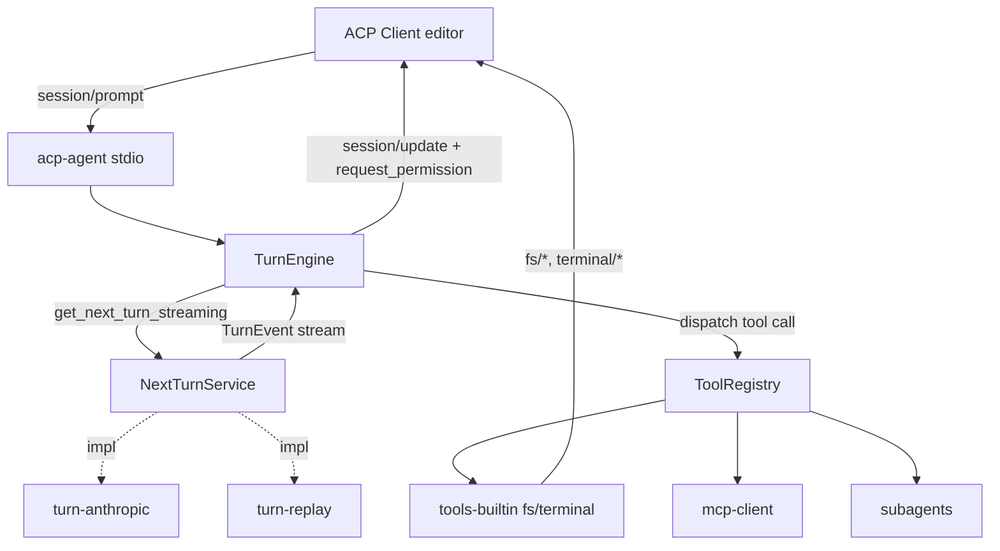
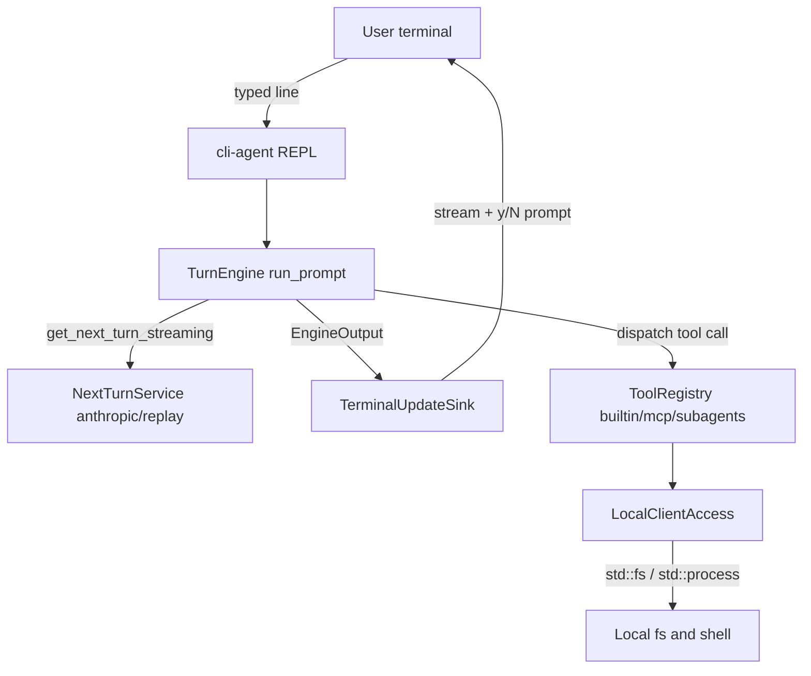
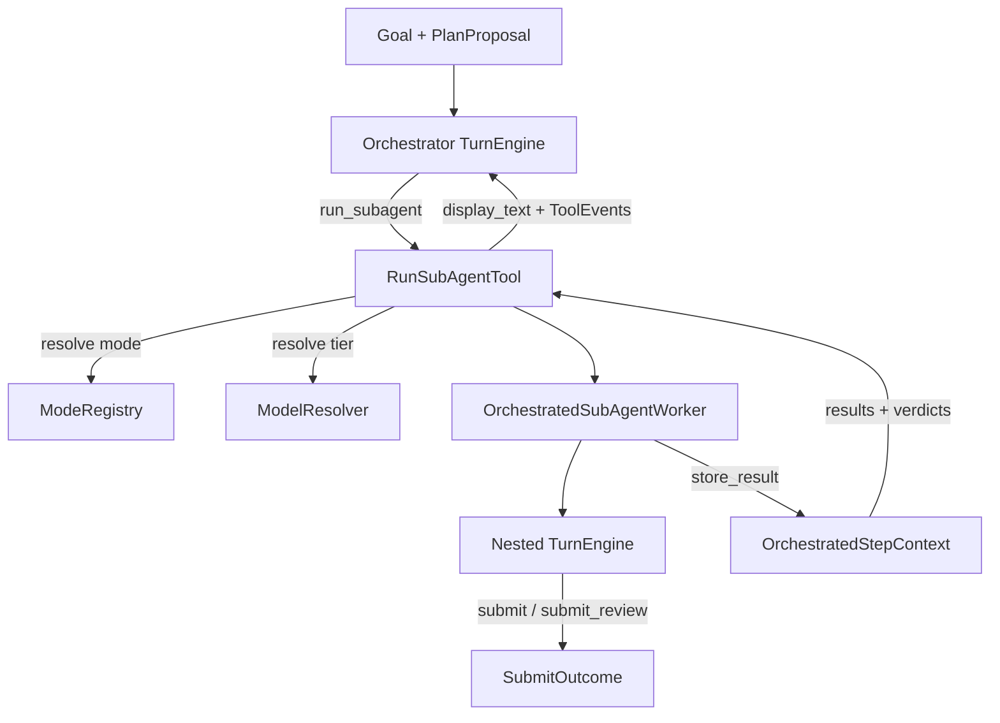

# Requirements

### Overview & Goals
Build a working **Agent Client Protocol (ACP)** agent in Rust that is **streaming-first**, **debuggable**, and **testable**. The agent connects to an ACP client (e.g. Zed, JetBrains) over **stdio** and answers prompts by driving a turn loop.

The central design principle is a clean separation between:
- the **decision layer** — an abstract `NextTurnService` (`get_next_turn_streaming`) that decides *what the agent does next* as a stream of events. Its concrete implementations are interchangeable: a real **Anthropic Messages API** backend, a deterministic **replay/recording** backend for tests, or scripted backends.
- the **services layer** — tools, MCP, subagents, ACP client access (fs/terminal), permissions — invoked by the turn engine in response to decision events.

The codebase is a **modular Cargo workspace**: each capability is its own crate behind a trait seam.

### Scope
**In Scope (v1)**
- ACP agent over **stdio** using the `agent-client-protocol` crate.
- Core methods: `initialize`, `authenticate` (no-op/passthrough), `session/new`, `session/prompt`, `session/cancel`.
- Streaming `session/update` output: `agent_message_chunk`, `plan`, `tool_call` / `tool_call_update`, and `session/request_permission`.
- `NextTurnService` abstraction with two implementations: **Anthropic** (real) and **replay** (deterministic, for tests/debugging).
- **Built-in tools**: filesystem read/write and terminal execution via ACP client methods.
- **MCP client**: connect to configured MCP servers and expose their tools in the turn loop.
- **Subagents**: a tool that spawns a nested agent turn (delegation).

**Out of Scope (v1)**
- Skills module (planned as a future pluggable module; trait seam left open).
- HTTP/WebSocket transport (stdio only for now).
- Multi-provider LLM backends beyond Anthropic (trait stays provider-agnostic to add later).
- Session persistence/resume, session list/delete.

### User Stories
- As an **editor user**, I send a prompt and see the agent's response stream token-by-token, with visible plan steps and tool activity.
- As an **editor user**, I am asked to grant/deny permission before destructive tool calls (file writes, terminal commands).
- As an **agent developer**, I can swap the real Anthropic backend for a recorded one and get fully deterministic, reproducible turn behavior in tests.
- As an **agent developer**, I can add a new tool, an MCP server, or a subagent as an isolated module without touching the turn engine.

### Functional Requirements
- The agent negotiates protocol version and advertises capabilities during `initialize`.
- On `session/prompt`, the agent runs a turn loop: decision events -> stream text to client -> execute tool calls -> feed results back -> repeat until a stop reason, then return the `session/prompt` response with a `stopReason`.
- Tool calls are surfaced as ACP `tool_call` updates with status transitions (pending -> in_progress -> completed/failed).
- Destructive tools request permission via `session/request_permission`; a denied permission aborts that tool call gracefully.
- `session/cancel` aborts in-flight LLM streaming and tool execution and returns a `cancelled` stop reason.

### Non-Functional Requirements
- **Streaming latency**: output chunks are forwarded to the client as they arrive, without buffering the full turn.
- **Testability**: the full turn loop is runnable without network via the replay backend and in-memory fake ACP client.
- **Debuggability**: structured `tracing` logs for every decision event, tool call, and ACP message; optional recording of turn event streams.
- **Modularity**: capability crates depend only on core trait definitions, not on each other.

# Technical Design

### Current Implementation
Greenfield project — the repository contains only IDE metadata (`rust-agent.iml`, `.idea/`) and no Rust sources yet. The design builds on the official [`agent-client-protocol`](https://crates.io/crates/agent-client-protocol) crate (v1.x), which provides the `Agent`/`Client` traits, JSON-RPC transport, and ACP schema types.

### Key Decisions
- **Decision layer = `NextTurnService`, not "LLM service"** — the abstraction represents *what the agent does next* as an event stream. Anthropic is just one implementation; replay/scripted are equal-class implementations. Rationale: keeps the turn engine provider-agnostic and fully testable.
- **Central `TurnEngine` + single event stream** (chosen over actor/channel pipeline) — the engine drives the loop, consumes a `Stream<TurnEvent>` from `NextTurnService`, dispatches tool calls, and maps everything to ACP `session/update`. Rationale: simplest streaming-first model, easy to follow and test.
- **Cargo workspace, multiple crates** (chosen over single crate) — strong module boundaries and independent testing per capability.
- **Anthropic Messages API** as the real backend, consumed as native SSE streaming with tool-use blocks.
- **stdio transport** only for v1.

### Proposed Changes
Create a Cargo workspace with capability crates that depend on `agent-core` trait definitions only.

**Core abstractions (`agent-core`):**
```rust
// The decision layer: what does the agent do next?
#[async_trait]
pub trait NextTurnService: Send + Sync {
    async fn get_next_turn_streaming(
        &self,
        ctx: &TurnContext,      // conversation history, available tools, system prompt
    ) -> Result<BoxStream<'static, TurnEvent>>;
}

// Streaming decision events (provider-agnostic)
pub enum TurnEvent {
    TextDelta(String),
    Thinking(String),
    Plan(PlanUpdate),
    ToolCallRequested { id: ToolCallId, name: String, arguments: serde_json::Value },
    TurnFinished { stop_reason: StopReason },
    Error(TurnError),
}

// The services layer: a callable capability
#[async_trait]
pub trait Tool: Send + Sync {
    fn name(&self) -> &str;
    fn schema(&self) -> serde_json::Value;      // JSON schema for arguments
    fn requires_permission(&self) -> bool;
    async fn call(&self, args: serde_json::Value, ctx: &ToolContext)
        -> Result<BoxStream<'static, ToolEvent>>;
}

pub struct ToolRegistry { /* name -> Arc<dyn Tool> */ }
```

**Turn engine (`agent-core`):**
```rust
pub struct TurnEngine {
    next_turn: Arc<dyn NextTurnService>,
    tools: ToolRegistry,
}
impl TurnEngine {
    // Runs the loop until a stop reason; emits EngineOutput items that the ACP
    // layer maps to session/update notifications.
    pub async fn run_prompt(
        &self, session: &mut SessionState, sink: &mut dyn UpdateSink,
    ) -> Result<StopReason>;
}
```
Loop: call `get_next_turn_streaming` -> forward `TextDelta`/`Plan` to `sink` -> on `ToolCallRequested`, look up the tool, request permission if needed, execute, stream `ToolEvent`s as `tool_call_update`, append the result to `SessionState` history -> repeat until `TurnFinished`.

**ACP binding (`acp-agent` binary):** implements the `agent-client-protocol` `Agent` trait; `initialize`/`session/new` set up `SessionState`; `session/prompt` constructs a `TurnEngine`, wires an `UpdateSink` that emits `session/update`, and drives `run_prompt`; `session/cancel` triggers a cancellation token consumed by both the decision stream and tool execution.

### Data Models / Contracts
- `SessionState`: session id, workspace roots, message history (user/assistant/tool turns), available tool descriptors.
- `TurnContext`: immutable view of history + tool schemas + system prompt passed to `NextTurnService`.
- `ToolContext`: access to the ACP `Client` handle (for `fs/*`, `terminal/*`), session id, cancellation token.
- `UpdateSink`: trait mapping engine output to ACP `session/update` (kept abstract so tests use an in-memory sink).

### Components
- **`agent-core`** — traits (`NextTurnService`, `Tool`, `UpdateSink`), `TurnEngine`, event model, `SessionState`, `ToolRegistry`.
- **`turn-anthropic`** — `NextTurnService` impl over Anthropic Messages API streaming (SSE -> `TurnEvent`).
- **`turn-replay`** — deterministic `NextTurnService` impl replaying a recorded/scripted `Vec<TurnEvent>` for tests & debugging.
- **`tools-builtin`** — `fs_read`, `fs_write`, `terminal_run` tools implemented via the ACP `Client` methods.
- **`mcp-client`** — connects to configured MCP servers, wraps each MCP tool as a `Tool`.
- **`subagents`** — a `Tool` that instantiates a nested `TurnEngine` (with its own `NextTurnService`) to handle delegated sub-tasks and streams progress back.
- **`acp-agent`** — binary: stdio transport, `Agent` trait impl, config loading, `tracing` setup.

### File Structure
```
Cargo.toml                # workspace
crates/
  agent-core/             # traits, TurnEngine, events, session state
  turn-anthropic/         # Anthropic NextTurnService impl
  turn-replay/            # deterministic replay NextTurnService
  tools-builtin/          # fs + terminal tools
  mcp-client/             # MCP integration
  subagents/              # subagent delegation tool
  acp-agent/              # binary: stdio ACP server
```

### Architecture Diagram


### Risks
- **Anthropic SSE mapping**: tool-use block streaming and partial JSON arguments must be assembled correctly before dispatch — mitigate with a dedicated parser tested against recorded fixtures.
- **Cancellation correctness**: a single `CancellationToken` must reach both the decision stream and running tools/subagents to avoid orphaned work.
- **Subagent recursion**: guard against unbounded nesting with a depth limit in `ToolContext`.
- **Permission race**: tool execution must not start before permission is granted; enforce in `TurnEngine` before `Tool::call`.

# Testing

### Validation Approach
Because the `NextTurnService` is an abstraction, the entire turn loop is validated deterministically without network access using the **`turn-replay`** backend plus an **in-memory fake ACP client/`UpdateSink`**. Real integration with Anthropic is validated separately behind an ignored/gated test.

### Key Scenarios
- **Plain streaming turn**: replay a `TextDelta` sequence -> assert the fake sink received matching `agent_message_chunk` updates in order and a correct final `stopReason`.
- **Single tool call**: replay `ToolCallRequested` for `fs_read` -> assert `tool_call` (pending->in_progress->completed) updates and that the tool result is appended to history and fed into the next decision call.
- **Permission flow**: a destructive `fs_write`/`terminal_run` triggers `session/request_permission`; test both granted (executes) and denied (tool call marked failed, loop continues).
- **MCP tool**: with a stub MCP server, assert an MCP-provided tool is discoverable and callable through the same `Tool` path.
- **Subagent delegation**: replay a `ToolCallRequested` for the subagent tool -> assert a nested turn runs and its output streams back as tool updates.

### Edge Cases
- **Cancellation mid-stream**: fire `session/cancel` during a long replay stream and during tool execution -> assert prompt returns `cancelled` and no further updates are emitted.
- **Malformed tool arguments**: decision emits invalid JSON args -> tool call fails gracefully with an error update, loop is not deadlocked.
- **Unknown tool name**: engine returns a structured error result to the decision layer instead of panicking.
- **Subagent depth limit** exceeded -> delegation refused with an error tool result.
- **Anthropic SSE parsing** unit tests against recorded raw SSE fixtures (partial tool-use JSON, interleaved text/thinking).

### Test Changes
- Unit tests colocated in each crate (`#[cfg(test)]`).
- `agent-core` integration tests using `turn-replay` + fake `UpdateSink`.
- Anthropic live test marked `#[ignore]`, run manually with an API key.

# Terminal CLI

### Overview & Goals
Add a **simple interactive terminal chat** so the agent can be run and used directly from a shell — no editor/ACP client required. You launch the binary, it prints a prompt, you type a message, and the assistant's answer streams back inline. It reuses the exact same turn machinery (`TurnEngine`, `NextTurnService`, `ToolRegistry`) as the ACP server; only the presentation (an `UpdateSink`) and the tool-backing client (`ClientAccess`) differ.

### Key Decisions
- **New `cli-agent` binary crate** — a thin front-end over the existing `agent-core` machinery, mirroring how `acp-agent` wires things. Rationale: keeps the ACP server untouched and follows the established modular crate boundaries.
- **Line-based REPL** (chosen over a full-screen ratatui TUI) — read a line from stdin, stream the answer to stdout, repeat. Rationale: user asked for a *simple* terminal UI; no extra TUI dependency, trivially testable.
- **Local direct execution for tools** — a `LocalClientAccess` implements `ClientAccess` against the real machine (`std::fs`, `std::process::Command`) since there is no editor to serve `fs/*` and `terminal/*`. Rationale: makes the built-in fs/terminal tools actually work from the CLI.
- **Same backend selection as `acp-agent`** — reuse `default_deps()`/`anthropic_factory()`/`canned_replay_factory()` so the CLI uses Anthropic when a key resolves (env or `token.properties`) and falls back to the deterministic replay backend otherwise.
- **Permission prompts on stdin** — the CLI `UpdateSink::request_permission` asks the user `[y/N]` inline before destructive tool calls.

### Current Implementation
The reusable wiring already exists in `acp-agent`'s library: `AgentConfig`, `NextTurnFactory`, `build_registry`, `default_deps`, plus the `TurnEngine::run_prompt(session, sink, cancel)` loop in `agent-core`. The `UpdateSink` and `ClientAccess` traits are the two seams the CLI must implement. `EngineOutput` variants (`MessageChunk`, `ThinkingChunk`, `Plan`, `ToolCall`, `ToolCallUpdate`) are what the terminal sink renders.

### Proposed Changes
- **`crates/cli-agent`** (new binary):
  - `main.rs` — set up `tracing` (to stderr, so it does not corrupt the chat on stdout), build deps, run the REPL loop.
  - `repl.rs` — read stdin lines; on each non-empty line append a user message to a persistent `SessionState` and call `TurnEngine::run_prompt`; handle `Ctrl-D`/`exit`/`quit` to terminate and `Ctrl-C` to cancel the in-flight turn via the `CancellationToken`.
  - `sink.rs` — `TerminalUpdateSink` implementing `UpdateSink`: print `MessageChunk`/`ThinkingChunk` incrementally (flushing stdout), render `ToolCall`/`ToolCallUpdate` as concise status lines, and implement `request_permission` as an inline `[y/N]` stdin prompt.
  - `local_client.rs` — `LocalClientAccess` implementing `ClientAccess` with `std::fs` reads/writes and `std::process::Command` execution (mapping output/exit code into `TerminalOutcome`).
- **Conversation continuity** — keep a single `SessionState` across REPL iterations so the chat has memory within a run.
- **Workspace** — add `cli-agent` to the root `Cargo.toml` members.

### File Structure
```
crates/
  cli-agent/              # NEW binary: interactive terminal chat
    src/
      main.rs             # tracing + deps + REPL bootstrap
      repl.rs             # stdin loop, cancellation, exit handling
      sink.rs             # TerminalUpdateSink (streaming + permission prompt)
      local_client.rs     # LocalClientAccess (std::fs / std::process)
```

### Architecture Diagram


### Risks
- **stdout interleaving**: streamed chunks and the `[y/N]` prompt share stdout; flush carefully and print permission prompts on their own line.
- **Cancellation via Ctrl-C**: a signal handler must trip the `CancellationToken` without killing the process, so the REPL survives a cancelled turn.
- **Blocking stdin vs async engine**: read input on a blocking task (`spawn_blocking` or a dedicated thread) so it does not stall the async runtime.

# Orchestration Requirements

### Overview & Goals
Add an **orchestrated execution** capability (per `docs/design/orchestrated-execution.md`) as a new `orchestrated` crate. A top-level **orchestrator LLM** receives a Goal and a `PlanProposal` and drives the work through an **un-fixed pipeline** by repeatedly calling a single tool, `run_subagent(mode, step_index, instructions?, scope?, model_tier?)`. The orchestrator never does the work itself — every implementation, review, and planning action is delegated to a **sub-agent** run in a specific **mode**.

The feature must be **scalable, observable, well-typed, testable, thread-safe, and not error-prone**, reusing the existing streaming-first seams (`TurnEngine`, `NextTurnService`, `Tool`/`ToolRegistry`, `UpdateSink`, `CancellationToken`) without modifying `agent-core`.

### Scope
**In Scope**
- New `orchestrated` crate with: `SubAgentMode` contract + families (Executor: `code`/`setup`/`niche`; Reviewer: `review`/`review_plan`; Planner: `plan`), a mode registry, the `run_subagent` tool, the sub-agent worker, and the orchestrator assembly.
- `OrchestratedStepContext` (already started) as the shared state passing results/verdicts between modes, keyed by `(mode_id, step_index)`, with attempt counters and the current `PlanProposal`.
- Model-tier resolution (`low`/`medium`/`high`) and escalation, provider-neutral via an injected resolver.
- Preconditions (e.g. `review` requires a prior executor result for the step; `review_plan` requires a planner result), retries, and structured reviewer verdicts.
- Streaming progress of each sub-agent run back through the orchestrator's turn as ordinary tool updates; `tracing` spans for observability.
- Deterministic tests using the `turn-replay` backend for both orchestrator and sub-agents.

**Out of Scope**
- Changes to `agent-core` trait definitions (the tool captures its own state; core stays untouched).
- Persisting orchestration state across process restarts.
- A dedicated ACP/CLI "orchestrated" front-end UX beyond a wiring toggle (basic wiring only).

### User Stories
- As an **agent developer**, I give the orchestrator a Goal + plan and it autonomously sequences implement/review/re-implement passes, deciding order and pass count itself.
- As an **agent developer**, I can add a new sub-agent mode as an isolated module implementing `SubAgentMode` without touching the orchestrator or the turn engine.
- As an **agent developer**, I can run the entire orchestration deterministically in tests via replay backends, asserting results/verdicts flow correctly between modes.
- As an **operator**, I can observe (via `tracing`) which mode/step/attempt is running and its outcome.

### Functional Requirements
- `run_subagent` parses `mode` (via `SubAgentMode::from_str`) and 1-based `step_index` (converted to 0-based), validates preconditions, records the attempt, resolves the model tier (honoring escalation or a mode's fixed model), runs the sub-agent to a stop reason, stores the `StepResult`, and returns a concise `display_text` to the orchestrator.
- Reviewer modes report success via a structured submit tool (`submit_review`), not text parsing; executors use a plain `submit`.
- A denied precondition or a refused delegation fails the tool call gracefully (a `Failed` tool result), never panics, and the orchestrator loop continues.
- Cancellation propagates from the orchestrator turn into the running sub-agent via the shared `CancellationToken`.

### Non-Functional Requirements
- **Thread-safety**: shared state guarded by `Mutex`; guards are never held across `.await`.
- **Observability**: a `tracing` span per `run_subagent` carrying `mode`, `step_index`, `attempt`, and outcome.
- **Testability**: orchestrator and sub-agents both driven by `turn-replay`; no network in unit/integration tests.
- **Modularity**: `orchestrated` depends only on `agent-core` (plus `turn-replay` as a dev-dependency).

# Orchestration Design

### Current Implementation
The `orchestrated` crate currently contains only `context.rs`: `ModelTier` (with `escalated()`/`from_str_opt`), `PlanStepSpec`, `PlanProposal` (with `render()`), `StepResult`, and `OrchestratedStepContext` (proposal + `(mode_id, step_index)`-keyed results + attempt counters, all `Mutex`-guarded). The reusable turn machinery lives in `agent-core` (`TurnEngine::run_prompt(session, sink, cancel)`, `NextTurnService`, `Tool`/`ToolRegistry`, `UpdateSink`, `ToolContext`). The `subagents` crate is the template: a `Tool` that spawns a nested `TurnEngine` with a `CapturingSink` and enforces a depth limit.

### Key Decisions
- **`SubAgentMode` trait + shared behavior structs** (chosen over a data-driven `ModeSpec`) — each mode is its own struct delegating to a shared `ExecutorBehavior`/`ReviewerBehavior`/`PlannerBehavior` via composition, mirroring the reference. Rationale: independently testable modes, easy to add new ones, no giant branch.
- **Per-mode submit action for verdicts** (chosen over parsing final text) — executors inject a `submit` tool; reviewers inject a structured `submit_review { approved, reasons }`. Success is read from the structured result. Rationale: typed, explicit, robust to phrasing.
- **`run_subagent` state captured in the tool struct** (chosen over extending `ToolContext`) — `RunSubAgentTool` owns `Arc<OrchestratedStepContext>`, the `ModeRegistry`, and a model resolver + worker factory; `agent-core` stays unchanged. Rationale: keeps orchestration self-contained in its crate.
- **Provider-neutral model resolution** — an injected `ModelResolver` (or `Fn(ModelTier) -> Arc<dyn NextTurnService>`) maps a tier to a decision backend, so escalation stays provider-agnostic.
- **Orchestrator is just a `TurnEngine`** whose registry contains only `run_subagent`, driven by its own `NextTurnService` and an orchestrator system prompt — no new engine type needed.

### Proposed Changes
**Mode contract (`mode.rs`):**
```rust
#[async_trait]
pub trait SubAgentMode: Send + Sync {
    fn id(&self) -> &str;
    fn orchestrator_kind(&self) -> OrchestratorKind;      // Executor | Reviewer | Planner
    fn is_plan_creation_mode(&self) -> bool { false }
    fn supports_retry(&self) -> bool;
    fn supports_model_escalation(&self) -> bool;
    fn fixed_model(&self) -> Option<ModelTier> { None }
    fn initial_max_steps(&self) -> usize;
    fn retry_max_steps(&self) -> usize;

    fn system_prompt(&self, ctx: &OrchestratedStepContext, step_index: usize) -> String;
    fn tool_capabilities(&self, base: &ToolRegistry) -> ToolRegistry;   // filter/extend
    fn submit_action(&self) -> Arc<dyn Tool>;                            // submit | submit_review
    fn build_issue_description(&self, req: &SubAgentRequest, step: Option<&PlanStepSpec>) -> String;
    fn build_pre_chat_observations(&self, ctx: &OrchestratedStepContext, step_index: usize) -> String;
    fn check_preconditions(&self, ctx: &OrchestratedStepContext, step_index: usize) -> Result<(), PreconditionError>;
    fn parse_success(&self, submit: &SubmitOutcome) -> bool;
    fn compress_result(&self, submit: &SubmitOutcome) -> String;
    fn display_text(&self, output: &str) -> String;
}
```
Shared behavior structs (`ExecutorBehavior`, `ReviewerBehavior`, `PlannerBehavior`) implement the common policy; concrete `data`-like mode structs (`CodeMode`, `SetupMode`, `NicheMode`, `ReviewMode`, `ReviewPlanMode`, `PlanMode`) hold an `Arc<Behavior>` and only override `id`/prompt-prefix/model specifics.

**Mode registry (`registry.rs`):** `ModeRegistry` maps `id -> Arc<dyn SubAgentMode>` with `from_str(mode)` returning a structured error for unknown modes.

**Submit actions (`submit.rs`):** `SubmitTool` and `SubmitReviewTool` implement `Tool`; they write a `SubmitOutcome` into a per-run shared slot (`Arc<Mutex<Option<SubmitOutcome>>>`) that the worker reads after the nested turn finishes.

**Sub-agent worker (`worker.rs`):** `OrchestratedSubAgentWorker` builds a nested `SessionState` (system prompt + issue description + pre-chat observations), constructs a `TurnEngine` with the mode's `tool_capabilities` (+ its submit action) and the tier-resolved `NextTurnService`, runs it to a stop reason with a `CapturingSink`, then computes success via `parse_success`.

**`run_subagent` tool (`action.rs`):** `RunSubAgentTool` (implements `Tool`) captures `Arc<OrchestratedStepContext>`, the `ModeRegistry`, and a `ModelResolver`; its `call` performs the 10-step flow from the reference (parse -> preconditions -> attempt -> resolve model/escalation -> worker run -> `store_result` -> stream progress -> return `display_text`), emitting `ToolEvent`s and a `tracing` span.

**Orchestrator assembly (`lib.rs`):** a builder that constructs the orchestrator `TurnEngine` (registry = only `run_subagent`) plus a default `ModeRegistry`, ready to be wired into `acp-agent`/`cli-agent` behind a toggle.

### Data Models / Contracts
- `SubAgentRequest { mode, step_index, instructions: Option<String>, scope: Option<String>, model_tier: Option<ModelTier> }` — parsed from `run_subagent` args.
- `SubmitOutcome { success: bool, output: String, reasons: Option<String> }` — written by submit tools, read by the worker.
- `OrchestratorKind { Executor, Reviewer, Planner }`.
- `ModelResolver: Fn(ModelTier) -> Arc<dyn NextTurnService>` (or a small trait) — injected, provider-neutral.
- Reuses `StepResult`, `PlanProposal`, `ModelTier` from `context.rs`.

### Components
- **`orchestrated::context`** — shared state (exists).
- **`orchestrated::mode`** — `SubAgentMode` trait + behavior structs + concrete modes.
- **`orchestrated::registry`** — `ModeRegistry`, `from_str`.
- **`orchestrated::submit`** — `SubmitTool`, `SubmitReviewTool`, `SubmitOutcome`.
- **`orchestrated::worker`** — nested-engine runner (built on the `subagents` pattern).
- **`orchestrated::action`** — `RunSubAgentTool`.
- **`orchestrated` (lib)** — orchestrator builder + `ModelResolver` seam; optional wiring into `acp-agent`/`cli-agent`.

### File Structure
```
crates/
  orchestrated/
    src/
      context.rs      # shared state (EXISTS)
      mode.rs         # SubAgentMode trait + behaviors + modes
      registry.rs     # ModeRegistry + from_str
      submit.rs       # SubmitTool / SubmitReviewTool / SubmitOutcome
      worker.rs       # OrchestratedSubAgentWorker (nested TurnEngine)
      action.rs       # RunSubAgentTool (the run_subagent tool)
      lib.rs          # re-exports + orchestrator builder + ModelResolver
```

### Architecture Diagram


### Risks
- **State lifetime across nested turns**: submit slot and `OrchestratedStepContext` are shared via `Arc<Mutex<..>>`; never hold a guard across `.await`.
- **Precondition ordering**: `review` before an executor result must fail cleanly — enforced in `check_preconditions` and surfaced as a `Failed` tool result.
- **Escalation loops**: bound retries/attempts; the orchestrator LLM decides passes, but the tool caps `max_steps` per attempt and clamps `ModelTier::escalated()` at `High`.
- **Cancellation**: the shared token must reach the nested engine so a cancelled orchestrator turn stops in-flight sub-agents.

# Orchestration Testing

### Validation Approach
Drive both the orchestrator and every sub-agent with `turn-replay`, so an entire Goal -> implement -> review -> re-implement flow runs deterministically with no network. Assert on `OrchestratedStepContext` state (stored results, attempts, verdicts) and on the streamed `ToolEvent`s / `display_text`.

### Key Scenarios
- **Single executor pass**: `run_subagent(mode=code, step_index=1)` runs a nested turn, stores a `StepResult`, returns `display_text`.
- **Implement -> review (approved)**: an executor result then `review` with a `submit_review{approved:true}` -> stored positive verdict, precondition satisfied.
- **Review before implement**: `review` with no prior executor result -> precondition fails gracefully (Failed tool result), no panic.
- **Escalation/retry**: a failed executor pass, then a retry with `model_tier=high` -> attempt counter increments and the higher tier resolves via `ModelResolver`.
- **Planner mode**: `plan` produces a `PlanProposal` stored into the context; `review_plan` requires it.

### Edge Cases
- **Unknown mode** -> `from_str` error surfaced as a Failed tool result.
- **Malformed args** (missing `mode`/`step_index`) -> graceful failure.
- **Cancellation mid sub-agent** -> orchestrator returns without emitting further updates.
- **Escalation clamp** at `High`.

### Test Changes
- Unit tests colocated per module (`mode`, `registry`, `submit`, `worker`, `action`).
- Integration test in `orchestrated/tests/` driving the orchestrator + sub-agents via replay through a full multi-pass flow.

# Delivery Steps

### ✓ Step 1: Scaffold workspace and core abstractions
A compiling Cargo workspace exists with `agent-core` defining the trait seams and event model.

- Create the workspace `Cargo.toml` and the `crates/` layout (`agent-core`, `turn-anthropic`, `turn-replay`, `tools-builtin`, `mcp-client`, `subagents`, `acp-agent`).
- In `agent-core`, define `NextTurnService` with `get_next_turn_streaming`, the `TurnEvent` enum, `Tool` trait, `ToolRegistry`, `SessionState`, `TurnContext`, `ToolContext`, and the `UpdateSink` trait.
- Add shared error types, `StopReason`, and a `CancellationToken` type.
- Set up `tracing` and add the `agent-client-protocol` dependency to the workspace.
- Add unit-test stubs verifying the crates build and traits are object-safe.

### ✓ Step 2: Implement TurnEngine loop with replay backend
`TurnEngine::run_prompt` drives a full turn deterministically using `turn-replay`, mapping events to an in-memory sink.

- Implement `TurnEngine::run_prompt`: consume the `TurnEvent` stream, forward `TextDelta`/`Thinking`/`Plan`, dispatch `ToolCallRequested`, append results to `SessionState`, and loop until `TurnFinished`.
- Implement `turn-replay` as a deterministic `NextTurnService` replaying a scripted `Vec<TurnEvent>`.
- Wire cancellation so both the decision stream and tool dispatch observe the token.
- Add integration tests (replay + in-memory `UpdateSink`) for plain streaming and stop-reason handling.

### ✓ Step 3: Wire the ACP stdio agent binary
The `acp-agent` binary runs as a stdio ACP server and streams a real prompt turn end-to-end (using replay).

- Implement the `agent-client-protocol` `Agent` trait in `acp-agent`: `initialize` (capability negotiation), `authenticate` (no-op), `session/new`, `session/prompt`, `session/cancel`.
- Implement an `UpdateSink` that emits ACP `session/update` (`agent_message_chunk`, `plan`, `tool_call`/`tool_call_update`) and `session/request_permission`.
- Bootstrap stdio JSON-RPC transport, config loading, and `tracing` output to stderr.
- Add an end-to-end test driving `session/prompt` through a fake client with the replay backend.

### ✓ Step 4: Add Anthropic NextTurnService backend
A real `turn-anthropic` backend answers prompts via the Anthropic Messages API streaming.

- Implement `NextTurnService` in `turn-anthropic` calling the Anthropic Messages API with streaming (SSE).
- Map SSE deltas to `TurnEvent`s: text deltas, thinking, and assembled tool-use blocks -> `ToolCallRequested`.
- Convert `TurnContext` (history + tool schemas + system prompt) into the Anthropic request body.
- Add SSE-parser unit tests against recorded fixtures and a live `#[ignore]` integration test.

### ✓ Step 5: Implement built-in tools with permission flow
The agent can read/write files and run terminal commands as ACP tool calls with permission gating.

- Implement `fs_read`, `fs_write`, and `terminal_run` in `tools-builtin` via the ACP `Client` methods (`fs/*`, `terminal/*`).
- Mark destructive tools as `requires_permission`; enforce `session/request_permission` in `TurnEngine` before `Tool::call`.
- Stream tool status transitions (pending -> in_progress -> completed/failed) as `tool_call_update`.
- Add tests for granted/denied permission and malformed-argument handling.

### ✓ Step 6: Add MCP client and subagent modules
External MCP tools and delegated subagents are usable within the same turn loop.

- Implement `mcp-client`: connect to configured MCP servers, enumerate their tools, and wrap each as a `Tool` registered in the `ToolRegistry`.
- Implement `subagents`: a `Tool` that spawns a nested `TurnEngine` (its own `NextTurnService`) to handle a delegated task and streams progress back, with a recursion depth limit.
- Register these modules in `acp-agent` config wiring.
- Add tests: MCP tool discovery/call with a stub server, and subagent delegation + depth-limit enforcement via the replay backend.

### ✓ Step 7: Scaffold the `cli-agent` crate with local client and streaming sink
A new `cli-agent` binary crate compiles with the two CLI seams implemented against the local machine.

- Add `crates/cli-agent` to the workspace `Cargo.toml` members and create its `Cargo.toml` depending on `agent-core`, `acp-agent` (for `default_deps`/factories/registry), and `tokio`/`tracing`.
- Implement `LocalClientAccess` (`local_client.rs`) satisfying `ClientAccess`: `read_text_file`/`write_text_file` via `std::fs`, and `run_terminal` via `std::process::Command` mapped into `TerminalOutcome`.
- Implement `TerminalUpdateSink` (`sink.rs`) satisfying `UpdateSink`: stream `MessageChunk`/`ThinkingChunk` to stdout with flushing, render `ToolCall`/`ToolCallUpdate` as status lines.
- Add unit tests for `LocalClientAccess` (round-trip file read/write, running a trivial command) and for the sink's rendering of `EngineOutput` variants.

### ✓ Step 8: Implement the interactive REPL loop and permission prompts
Running the binary opens an interactive chat that streams answers and gates destructive tools.

- Implement `repl.rs`: build deps via `acp_agent::default_deps()`, construct a persistent `SessionState` and a `TurnEngine` (with `LocalClientAccess` attached), then loop reading stdin lines and driving `run_prompt` per user message.
- Implement `TerminalUpdateSink::request_permission` as an inline `[y/N]` stdin prompt returning grant/deny.
- Wire `Ctrl-C` to trip a per-turn `CancellationToken` (turn is cancelled, REPL continues) and `Ctrl-D`/`exit`/`quit` to leave the loop cleanly; run blocking stdin reads off the async executor.
- Route `tracing` output to stderr so logs never corrupt the chat stream on stdout.
- Add an end-to-end test driving the REPL with the replay backend over piped stdin and asserting streamed output; document the `cargo run -p cli-agent` launch command in the design docs.

### ✓ Step 9: Define the SubAgentMode contract, behaviors, and mode registry
The `orchestrated` crate exposes a typed, extensible mode system with all six modes registered.

- Add `mode.rs` with the `SubAgentMode` trait and `OrchestratorKind` enum.
- Implement shared `ExecutorBehavior`, `ReviewerBehavior`, and `PlannerBehavior` structs holding the common policy (tool capabilities, max-steps, escalation/retry flags, prompt scaffolding).
- Implement concrete modes via composition: `CodeMode`/`SetupMode`/`NicheMode` (executor), `ReviewMode`/`ReviewPlanMode` (reviewer), `PlanMode` (planner) — each delegating to a shared behavior and overriding only `id`, prompt prefix, and model specifics.
- Add `registry.rs` with `ModeRegistry` (`id -> Arc<dyn SubAgentMode>`) and `from_str` returning a structured error for unknown modes.
- Add unit tests: registry lookup/`from_str`, per-mode flags (retry/escalation/fixed model), and precondition stubs.

### ✓ Step 10: Implement submit actions and the sub-agent worker
A sub-agent turn runs in a chosen mode, reports a typed verdict, and returns a captured result.

- Add `submit.rs` with `SubmitOutcome` plus `SubmitTool` (executor) and structured `SubmitReviewTool` (`submit_review { approved, reasons }`), writing into a per-run `Arc<Mutex<Option<SubmitOutcome>>>` slot.
- Add `worker.rs` (`OrchestratedSubAgentWorker`) modeled on the `subagents` pattern: build a nested `SessionState` (mode system prompt + issue description + pre-chat observations), assemble a `TurnEngine` from the mode's `tool_capabilities` + submit action + a tier-resolved `NextTurnService`, run it with a `CapturingSink`, and compute success via `parse_success`.
- Add a provider-neutral `ModelResolver` seam mapping `ModelTier -> Arc<dyn NextTurnService>`.
- Add tests via `turn-replay`: a mode runs, submits, and the worker reports success/output; a reviewer submits a verdict.

### ✓ Step 11: Implement the run_subagent tool over OrchestratedStepContext
`run_subagent` executes the full reference flow, threading results and verdicts between modes.

- Add `action.rs` with `RunSubAgentTool` (implements `Tool`) capturing `Arc<OrchestratedStepContext>`, the `ModeRegistry`, and the `ModelResolver`; define its JSON schema (`mode`, `step_index`, optional `instructions`/`scope`/`model_tier`).
- Implement `call`: parse `SubAgentRequest` (1-based -> 0-based), check preconditions, record the attempt, resolve the model tier (escalation clamped at `High`, or a mode's fixed model), run the worker, `store_result` into the context, stream `ToolEvent` progress, and return `display_text`.
- Emit a `tracing` span carrying `mode`/`step_index`/`attempt`/outcome; ensure `Mutex` guards are never held across `.await`.
- Add tests: single executor pass, implement->review(approved), review-before-implement precondition failure, escalation/retry attempt counting, unknown mode + malformed args.

### ✓ Step 12: Assemble the orchestrator and wire it in
An orchestrator agent can be constructed and driven end-to-end, with optional wiring into the existing binaries.

- Add the orchestrator builder to `lib.rs`: construct a `TurnEngine` whose registry contains only `run_subagent`, seed the orchestrator system prompt, and expose the default `ModeRegistry` + `ModelResolver` injection points; re-export the public API.
- Add an optional toggle in `acp-agent`/`cli-agent` config to run in orchestrated mode (planner/executor/reviewer backends resolved from the existing factories).
- Add an integration test in `orchestrated/tests/` driving a full Goal -> plan -> code -> review multi-pass flow with replay backends, asserting stored results and verdicts.
- Update `docs/design/orchestrated-execution.md` with the Rust module mapping and the accepted decisions.