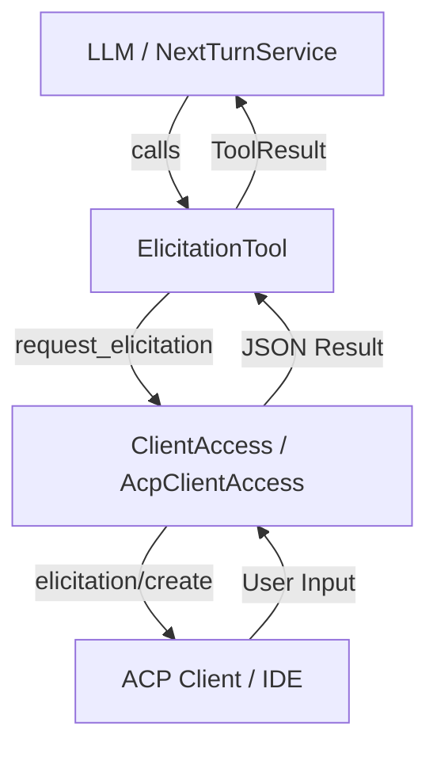

# Requirements

### Overview & Goals
The goal is to implement elicitation support in the ACP agent, allowing the agent to request structured user input (like API keys, configuration, or specific choices) from the client via the `elicitation/create` protocol method.

### Scope
- **In Scope**:
    - Enabling the `unstable_elicitation` feature in the `agent-client-protocol` dependency.
    - Adding `request_elicitation` to the `ClientAccess` trait in `agent-core`.
    - Implementing `request_elicitation` in `AcpClientAccess` using ACP `elicitation/create`.
    - Adding a built-in `elicitation` tool that exposes this capability to the LLM.
    - Supporting `form` mode elicitation.
- **Out of Scope**:
    - Supporting `url` mode elicitation (can be added later if needed).
    - Implementing complex validation of the returned JSON schema in the agent (rely on the protocol layer).

# Technical Design

### Current Implementation
- `ClientAccess` provides an abstraction for filesystem and terminal operations.
- `AcpClientAccess` translates these calls into ACP requests.
- `TurnEngine` drives tool execution via `ToolRegistry`.

### Key Decisions
- **Tool-based Elicitation**: Expose elicitation as a standard tool (`elicitation`). This allows any model provider (Anthropic, etc.) to use it by simply "calling the tool" when it needs more information.
- **Blocking Request**: Like `request_permission`, `request_elicitation` will block the current tool execution task until the user responds via the client.
- **Schema Pass-through**: Use `serde_json::Value` for the elicitation schema in the core layers to maintain protocol-agnosticism, while mapping it to `ElicitationSchema` in the ACP layer.

### Proposed Changes

#### Data Models
```rust
// crates/agent-core/src/client.rs
pub trait ClientAccess {
    // ...
    async fn request_elicitation(
        &self,
        title: String,
        description: Option<String>,
        requested_schema: serde_json::Value,
    ) -> Result<serde_json::Value>;
}
```

#### Architecture Diagram


### File Structure
- `crates/agent-core/src/client.rs`: Updated `ClientAccess` trait.
- `crates/acp-agent/src/client.rs`: Implemented `request_elicitation`.
- `crates/tools-builtin/src/lib.rs`: Added `ElicitationTool`.
- `crates/acp-agent/tests/elicitation.rs`: New integration tests.

# Testing

### Validation Approach
Verification will be performed using integration tests with a mock ACP client.

### Key Scenarios
- **Simple Form**: Agent requests a string (e.g., "name"), user provides it, tool returns the name.
- **User Decline**: User declines the elicitation, tool returns a failure/error message.
- **User Cancel**: User cancels the elicitation, tool returns a failure/error message.

### Test Changes
- **Integration Tests**:
    - `tests/elicitation.rs`: End-to-end flow from tool call to `elicitation/create` and back.

# Plan
### ✓ Step 1: Enable `unstable_elicitation` feature in `agent-client-protocol`
Introduce the necessary protocol features by enabling the `unstable_elicitation` feature flag in `agent-client-protocol` dependency.

### ✓ Step 2: Update `ClientAccess` trait in `agent-core`
Add `request_elicitation` method to the `ClientAccess` trait to allow agents to request user input.

### ✓ Step 3: Implement `request_elicitation` in `AcpClientAccess`
Provide the ACP-specific implementation of `request_elicitation` using the `elicitation/create` protocol method.

### ✓ Step 4: Add `ElicitationTool` in `tools-builtin`
Expose the elicitation capability to the LLM via a new built-in tool.

### ✓ Step 5: Add integration tests
Verify the elicitation flow with end-to-end integration tests using a mock ACP client.