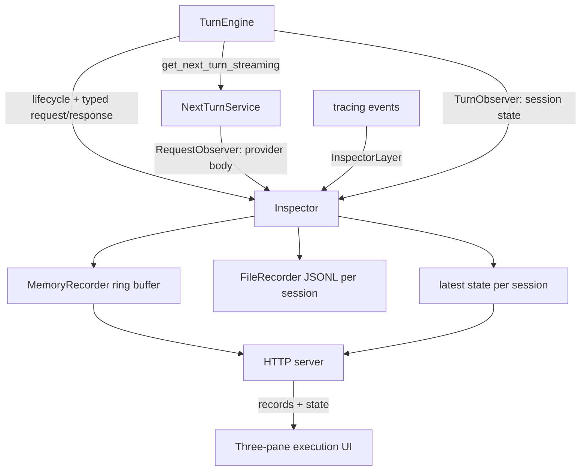

# LLM Inspector

A small, self-contained observability server that shows the requests the agent
sends to the model in a simple web UI. It starts automatically when `acp-agent`
boots, groups captured requests by session (the agent supports many concurrent
sessions), and also mirrors every capture to per-session JSONL files on disk.

Each new ACP session is greeted with its **own** inspector link as its first
message (`http://<addr>/?session=<id>`), so a user can jump straight to that
session's live request feed.

## Why

When debugging the agent it is invaluable to see not just what it asks the model
on every decision round, but also what comes back and what the agent does
internally. The inspector captures **four** complementary record kinds:

- a **typed** request view — the provider-neutral, strongly-typed request
  snapshot (system prompt, tools, the full typed conversation history). This is
  the readable form and is captured for **every** backend, including the offline
  replay backend;
- a **provider** request view — the exact JSON wire body sent to a specific
  provider (e.g. Anthropic), including compiled prompt caching, thinking
  settings, etc.;
- a **response** view — the provider-neutral, typed snapshot of what the model
  *replied* with for a round: assistant text, thinking size, requested tool
  calls, the round's **token usage and prompt-cache reuse**, stop reason, and
  duration. Captured for every backend via `TurnObserver::on_turn_response`; and
- a **log** view — the agent's own `tracing` events (level, target, message,
  structured fields), so "what the agent is doing" is visible alongside the
  model traffic.

Separately from that append-only record stream, the inspector also keeps the
latest **session state** per session (see [Session state view](#session-state-view)).

### Execution identity and hierarchy

A single user session can run several agents: the top-level chat/orchestrator
engine plus nested sub-agents (`subagents`, the `orchestrated` worker,
`run_pipeline`). `AgentPath` remains a readable breadcrumb, but is not used as
identity: retries can have the same path, and timestamps cannot reconstruct
causality reliably. Every observed operation therefore carries a typed
`TraceContext` with `turn_id`, `agent_run_id`, `parent_agent_run_id`,
`spawned_by_tool_call_id`, `round_id`, and structured mode/step/attempt/tier
metadata.

The hierarchy is `Session -> Prompt turn -> Agent run -> LLM round -> Tool call
-> Child agent run`. `TurnEngine` emits balanced append-only lifecycle events.
Backend errors and cancellation emit finish events too, so finished work never
remains falsely active. A durable start without a matching finish represents an
interrupted node rather than disappearing.

## Architecture

Two capture seams feed one `Inspector`:

- **Provider-neutral, in the engine** — `agent_core::TurnObserver::on_turn_request`
  is called by `TurnEngine` right before each `NextTurnService` call with a
  `TurnObservation` (trace context, session id, system prompt, tools, typed
  history, subagent depth). Because it lives in the engine, it captures every
  backend.
- **Provider-specific, in the backend** — `turn_anthropic::RequestObserver::on_request`
  is called by `AnthropicTurnService` with the exact body right before it is
  sent. `TurnContext` carries the same trace context, so the provider body joins
  the exact request/response round instead of being matched by time.

A third seam captures agent logs:

- **Agent logs, via a tracing layer** — `llm_inspector::InspectorLayer` is a
  `tracing_subscriber::Layer` that forwards every log event (outside the
  inspector's own target) into the `Inspector` as a `Log` record. It inherits
  fields from the complete tracing span chain, so nested logs attach to the
  correct agent run/tool without repeating IDs on every event. It is
  installed by `init_tracing_with_inspector`, called from `acp-agent` startup
  before any other tracing setup.

`llm_inspector::Inspector` implements the observer traits. It builds a unified
`CapturedRequest` (`kind = "typed" | "provider" | "response" | "log" |
"trace"`, carrying an optional `TraceContext`) and fans it out to a set of
`Recorder`s:

- `MemoryRecorder` — thread-safe, capacity-bounded (`DEFAULT_CAPACITY = 500`,
  newest-wins) ring buffer that backs the web UI. Its `Mutex` guard is only held
  for the synchronous push/trim — never across an `.await`.
- `FileRecorder` — appends each record as newline-delimited JSON to
  `<dir>/<session_id>.jsonl`, so logs mirror the UI's per-session grouping and
  are trivially greppable/tailable. Write failures are logged, never fatal.

Adding another destination (e.g. a database) is just another `Recorder`.

`llm_inspector::serve(inspector, addr)` runs a tiny, dependency-free HTTP/1.1
server over `tokio` (no web framework) exposing:

- `GET /` — the embedded HTML dashboard (auto-refreshes every 2s); honors a
  `?session=<id>` query param to filter to one session, and
- `GET /api/sends[?session=<id>]` — retained records as JSON, newest first, and
- `GET /api/state[?session=<id>]` — the latest persisted state per session.

The UI has three panes: session navigation; a causal execution tree; and details
for the selected turn, run, round, or tool. The tree shows status, duration,
tokens and cache reuse, distinguishes structured attempts, and nests child runs
under their spawning tool calls. Details offer Summary, Conversation, Request,
Provider, Response, Tools, Logs and Raw tabs. **Known tools**
(`fs_read`/`fs_write`/`edit`/`terminal_run`/
`run_subagent`/`orchestrate`/`delegate`/`submit*`) render with friendly titles
and argument previews instead of raw JSON; unknown/MCP tools fall back to pretty
JSON. Every record still exposes its full raw JSON on demand.

## Session state view

Beyond the per-round request/response stream, the debug UI shows the **live
state the agent persists for each session** — the durable memory kept *between*
turns (`agent_core::SessionState`/`SessionRecord`): the conversation history,
cumulative token usage (with prompt-cache reuse), the primary working directory
and ordered additional roots, system prompt, current mode (`chat`/`orchestrate`), canonical todo list (stable IDs,
content, and statuses), and available tools.

This flows through a provider-neutral seam: `agent_core::TurnObserver` gained a
default `on_session_state(&SessionStateSnapshot)` hook, and `acp-agent` calls it
(via a small `publish_session_state` helper) at every point the session's core
state changes — on `session/new`, after each `session/prompt` turn, and on
`session/load`. The `Inspector` implements the hook and keeps only the
**latest** snapshot per session in a separate map (not the bounded record ring),
so the state shown is always current rather than a scrolling log.

In the web UI each session group has a pinned **"session state"** entry at the
top; selecting it renders the mode, usage/reuse grid, the working directory and
additional roots, system
prompt, canonical todo list, tool list, and the full typed conversation history
(reusing the same history renderer as typed records). Sessions that exist but
have not run a turn yet still appear, so a freshly created session's state is
visible immediately.

## Wiring

`acp-agent`'s `main.rs` builds one `Inspector` (with file logging when a log dir
is configured) **before** initializing tracing, installs it as a tracing layer
via `init_tracing_with_inspector` (so agent logs are captured from the first
line), then starts the server and attaches the same instance to the request and
provider seams plus records the bound base URL via
`default_deps_with_observers(request_observer, turn_observer, base_url)`.
`AgentDeps.turn_observer` is attached to every chat/steering `TurnEngine`
(`TurnEngine::with_observer`) — capturing both requests and responses — and, in
orchestrate mode, threaded through `run_pipeline_observed` so the orchestrator
and every sub-agent are captured too. `AgentDeps.inspector_base_url` drives the
per-session welcome prepared in `session/new` and emitted as the first
`AgentMessageChunk` of the first prompt turn. ACP has no separate assistant
message-boundary update, so subsequent model chunks continue that visible
message after the URL prefix.

When an IDE starts a pool of agent processes, the first process may occupy the
preferred port. `serve_with_fallback` retries only `AddrInUse` on an ephemeral
port bound to the same interface. Each process therefore advertises its own
actual bound URL and never points a session at another process's in-memory
inspector. Other startup failures are logged and the agent continues without
the inspector.

## Configuration

| Env var                  | Default                             | Meaning                                                        |
|--------------------------|-------------------------------------|----------------------------------------------------------------|
| `ACP_INSPECTOR`          | on                                  | Set to `0`/`false`/`no`/`off` to disable the server            |
| `ACP_INSPECTOR_ADDR`     | `127.0.0.1:7878`                    | Bind address for the inspector HTTP server                     |
| `ACP_INSPECTOR_LOG_DIR`  | `<temp>/rust-acp-agent/llm-logs`    | Directory for per-session JSONL logs; `off`/empty disables it  |

Open `http://127.0.0.1:7878/` after starting a single `acp-agent` process, or
follow the per-session link the agent posts as each session's first message.
Pooled processes may use a different automatically selected port, so their
advertised per-session link is authoritative.

## Debug-bundle regression: `cd4d19cd`

The 2026-07-14 ACP bundle contained many `run_subagent` calls, including `code`
step 1 attempts 1 and 2, a failed review of the wrong step, and later retries.
A flat path list could not show which attempt or parent call owned each output.
Several code agents also printed shell commands as text because their nested
`SessionState.available_tools` was empty even though tools existed in the
dispatch registry.

Nested ordinary and orchestrated sessions now advertise descriptors from their
actual registry before calling the backend. A regression test inspects the real
typed sub-agent request and requires its submit schema. The bundle also exposes
a separate continuity issue: a later user message starts a fresh pipeline and
does not retain the previous orchestrator context; that remains a follow-up for
orchestration session continuity rather than an inspector issue.

## Limitations (v1)

- Typed request/response capture covers every backend; provider-body capture is
  implemented for Anthropic only (other providers can add their own
  `RequestObserver`).
- The in-memory buffer is bounded (ring buffer, shared across all record kinds);
  the JSONL files are the durable record and grow unbounded until removed.
- The server serves plain HTTP on localhost and has no auth — intended for local
  debugging only.
- Logs outside an agent/tool span and without a session field still appear under
  `(unknown)`; scoped logs inherit full run/tool identity.
- The browser still refreshes every two seconds. Append-only IDs make future SSE
  transport straightforward, but polling remains sufficient for local v1.
