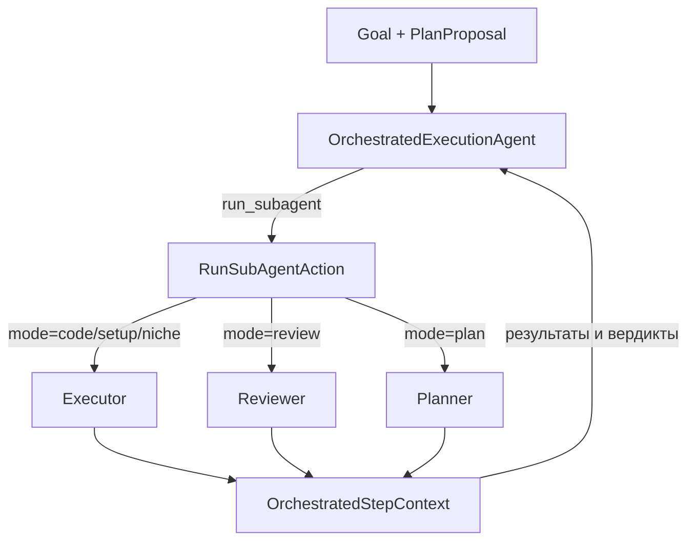

# Оркестрированное выполнение (Orchestrated Execution)

Этот документ описывает режим оркестрации в standalone-агенте Junie: как агент получает
Goal и план (`PlanProposal`) и через **нефиксированный** pipeline проводит его через
реализацию (Implement), проверку (Review) и другие фазы, вызывая суб-агентов в нужных
режимах.

Ключевые файлы (`ej-core-standalone`, пакет
`com.intellij.ml.llm.matterhorn.ej.standalone.agents.orchestrated`):

- `orchestratedExecution/OrchestratedExecutionAgent.kt` — верхнеуровневый агент-оркестратор.
- `actions/RunSubAgentAction.kt` — реализация инструмента `run_subagent`.
- `subagent/SubAgentMode.kt` — базовый контракт режима суб-агента.
- `subagent/ExecutorSubAgentModes.kt`, `subagent/ReviewerSubAgentModes.kt`,
  `subagent/PlanSubAgentMode.kt` — конкретные режимы.
- `subagent/ExecutorModeBehavior.kt`, `subagent/ReviewerModeBehavior.kt` — общее поведение
  семейств режимов (через композицию).
- `subagent/OrchestratedSubAgentWorker.kt` — обёртка запуска суб-агента.

## Основная идея

Оркестратор **не выполняет работу сам** — он дирижирует. Верхнеуровневый LLM-агент
получает Goal и текущий план и на каждом шаге решает, какого суб-агента и в каком режиме
запустить следующим. Вся работа (правки кода, установка окружения, ревью, планирование)
делегируется суб-агентам через единственный инструмент `run_subagent`.

Pipeline **нефиксированный**: нет захардкоженного конвейера «сначала plan, потом code,
потом review». Последовательность и число проходов определяет сам оркестратор-LLM,
опираясь на текст плана и результаты предыдущих вызовов. Порядок Implement → Review — это
*решение модели*, а не жёсткий код.

## Кто главный: `OrchestratedExecutionAgent`

- Идентификатор `orchestrated_plan`; получает Goal (`taskRequest.request`) и текущий
  `PlanProposal`.
- `useSubagents = false` (собственных суб-агентов не порождает напрямую), `maxSteps = 200`.
- Его цикл — это LLM, у которого есть инструмент
  `run_subagent(mode, step_index, instructions?, scope?, model_tier?)`.
- Между вызовами общее состояние хранится в `OrchestratedStepContext`: `PlanProposal`,
  результаты по каждому ключу `(mode.id, stepIndex)`, счётчики попыток, путь к файлу плана.

## Режимы суб-агентов: `SubAgentMode`

`SubAgentMode` — это `sealed class`, описывающий один режим суб-агента. Поведение режима
инкапсулировано **через композицию, а не наследование**: каждый режим держит ссылку на
общий behavior-объект и делегирует ему.

Три семейства режимов (все — `data object`):

- **Executor** (`Code`, `Setup`, `Niche`) — `ExecutorSubAgentModes.kt`. Различаются лишь
  `id`, `orchestratorKind`, форсированным `PromptInteractionMode` и префиксом артефакта.
  Всю логику делегируют общему `ExecutorModeBehavior`: read-only + edit + bash + discovery
  инструменты, поддержка эскалации модели и ретраев.
- **Reviewer** (`Review`, `ReviewPlan`) — `ReviewerSubAgentModes.kt`. Общая политика в
  `ReviewerModeBehavior`: только read-only инструменты, специальный
  `ReviewerSubmitAgentToolAction`, успех определяется вердиктом (`parseSuccess`), без
  ретраев, фиксированная модель (`OrchestratedReviewerSpec`).
- **Planner** (`Plan`) — `PlanSubAgentMode.kt`. Пишет файл-план и отдаёт его через
  `PlanSuggestedEvent`, переопределяя `presentResult`.

### Что настраивает каждый режим

Базовый контракт `SubAgentMode` (методы/свойства под конкретный режим):

- `createPromptProvider(...)` — системный промпт суб-агента.
- `toolCapabilities` — набор доступных инструментов (executor может редактировать, reviewer
  только читает).
- `createSubmitAction(...)` — как суб-агент завершает работу (обычный submit vs.
  структурированный tool-result у reviewer/plan).
- `buildIssueDescription(...)` — формулировка задачи с учётом `step`, `scope`, `instructions`.
- `buildPreChatObservations(...)` — контекст: сам план, описание шага, результаты
  предыдущих executor'ов, вердикт прошлого review и т.д.
- `checkPreconditions(...)` — например, `Review` требует уже готового результата executor'а
  для шага; `ReviewPlan` — результата планировщика.
- `compressResult(...)` / `displayText(...)` / `presentResult(...)` — компрессия результата
  в историю, человекочитаемый текст и показ в UI.
- `initialMaxSteps`/`retryMaxSteps`, `supportsModelEscalation`, `supportsRetry`,
  `fixedModelSpec`, `isPlanCreationMode`, `orchestratorKind`.

## Как проходит один вызов `run_subagent`

Реализация — `RunSubAgentAction.executeRequest`:

1. Парсит `mode` (`SubAgentMode.fromString`) и `step_index` (1-based → 0-based).
2. Берёт `OrchestratedStepContext` — общее состояние оркестрации.
3. Для plan-режимов (`isPlanCreationMode`) допускает отсутствие плана; иначе требует
   `proposal`.
4. Проверяет `checkPreconditions` (например, нельзя review без выполненного шага).
5. Определяет `isRetry`/`attempt`, шлёт `OrchestratorStepStartedEvent` (UI-блок «TASK»).
6. Строит `AgentIssue` (`buildIssueDescription` + `buildPreChatObservations` +
   `previousTasksInfo`), резолвит модель (`model_tier`/эскалация или фиксированная),
   выставляет `maxSteps`.
7. Создаёт `SubAgentActionsResolver` + `OrchestratedSubAgentWorker(mode)` и запускает
   суб-агента через `runSubagentWorker`.
8. `compressResult` → `stepContext.storeResult(mode.id, stepIndex, ...)` — результат
   сохраняется, чтобы следующие режимы (review, следующий шаг) его видели.
9. `presentResult` показывает результат в UI (обычный «ANSWER»-блок или suggest-plan для
   `Plan`).
10. Возвращает оркестратору `displayText(result.output)` — краткий итог, на основе которого
    он решает следующий шаг.

`OrchestratedSubAgentWorker` — тонкая обёртка над `StandaloneIssueAgentWorker`: подставляет
промпт из `mode`, подавляет собственный финальный event (чтобы не дублировать блоки
оркестратора) и, если у режима `hasCustomResultFormat`, формирует результат специальным
образом.

## Как получается «Goal → Implement → Review → …»

Оркестратор итеративно вызывает `run_subagent`: для шага плана запускает
`code`/`setup`/`niche` (реализация), затем `review` (проверка); при негативном вердикте
может снова запустить executor с `instructions` или увеличенным `model_tier` (эскалация),
при необходимости — заранее `plan`/`review_plan`. Общий `OrchestratedStepContext` передаёт
результаты между режимами (executor видит вердикт review, review видит историю executor'а),
а **последовательность и число проходов определяет сам оркестратор-LLM**, а не фиксированный
код — отсюда «нефиксированный pipeline».

## Реализация на Rust: crate `orchestrated`

Reference-дизайн выше реализован в crate `crates/orchestrated`, поверх seam'ов
`agent-core` (`TurnEngine`, `NextTurnService`, `Tool`/`ToolRegistry`, `UpdateSink`,
`CancellationToken`) без изменений самого `agent-core`. Соответствие модулей:

| Kotlin (reference) | Rust (`orchestrated::`) |
| --- | --- |
| `OrchestratedStepContext` | `context` — `OrchestratedStepContext`, `PlanProposal`, `PlanStepSpec`, `StepResult`, `ModelTier` |
| `SubAgentMode.kt` | `mode::SubAgentMode` + `OrchestratorKind`, `SubmitKind`, `PreconditionError`, `SubAgentRequest`, `SubmitOutcome` |
| `ExecutorModeBehavior` / `ReviewerModeBehavior` / (planner) | `mode::ExecutorBehavior` / `ReviewerBehavior` / `PlannerBehavior` |
| `ExecutorSubAgentModes` / `ReviewerSubAgentModes` / `PlanSubAgentMode` | `mode::{ExecutorMode (code/setup/niche), ReviewMode, ReviewPlanMode, PlanMode}` |
| `SubAgentMode.fromString` | `registry::ModeRegistry::{with_defaults, from_str}` (структурная ошибка `UnknownModeError`) |
| `createSubmitAction` (submit vs. reviewer submit) | `submit::{SubmitTool, SubmitReviewTool}` пишут `SubmitOutcome` в per-run `SubmitSlot` |
| `OrchestratedSubAgentWorker` | `worker::OrchestratedSubAgentWorker` (вложенный `TurnEngine` + `CapturingSink`) |
| `RunSubAgentAction.executeRequest` | `action::RunSubAgentTool` (реализует `Tool`) |
| `OrchestratedExecutionAgent` | `orchestrator::{OrchestratorBuilder, Orchestrator}` — `TurnEngine` с единственным `run_subagent` |
| резолв модели (`model_tier`/эскалация) | `worker::ModelResolver` (provider-neutral seam) + `FnModelResolver` |

### Запуск в рантайме (ACP-мод и `orchestrate`-тул)

Оркестрация доступна в рантайме двумя путями поверх единого `PipelineSession`:

- **Нативный ACP session-mode.** `acp-agent` на `session/new` анонсирует режимы
  `chat` (по умолчанию) и `orchestrate` (`NewSessionResponse::modes`), а `session/set_mode`
  переключает текущий режим сессии (`SessionEntry.mode`). Первый `session/prompt` в
  `orchestrate` лениво создаёт per-session `PipelineSession`, а следующие prompt'ы добавляются
  в его существующую типизированную историю. Тот же объект сохраняет
  `OrchestratedStepContext` (proposal, результаты и попытки суб-агентов). При первом входе
  из `chat` runtime наследует полную типизированную историю, workspace и usage; исходные
  пользовательские сообщения также входят в неявный Goal вместе с текущим уточнением.
  Поэтому даже после отменённого первого turn короткая фраза вроде «с нуля» видит исходную
  цель. После каждого orchestration-turn общая история синхронизируется обратно в chat-state,
  так что переключение режимов двустороннее. Флаг
  `ACP_ORCHESTRATED` теперь задаёт **начальный** режим сессии (обратная совместимость).
- **Инструмент `orchestrate { goal }`.** `orchestrated::OrchestrateTool` (по образцу
  `subagents::SubagentTool`) запускает `run_pipeline` вложенно внутри текущего turn'а и
  стримит прогресс суб-агентов как `ToolEvent`. Регистрируется в базовый реестр чата за
  флагом `AgentConfig.enable_orchestrate_tool` (env `ACP_ORCHESTRATE_TOOL`), чтобы чат-агент
  мог сам решить запустить пайплайн.
- **CLI.** В `cli-agent` команда `/orchestrate <goal>` вызывает тот же `run_pipeline` с
  `LocalClientAccess`-инструментами и `TerminalUpdateSink`.

Все тиры модели резолвятся в один и тот же backend через
`orchestrated::uniform_resolver(factory)` (Anthropic-или-replay, как у чата). Для каждого
суб-агента фабрика создаёт отдельный backend; backend самого оркестратора живёт вместе с
`PipelineSession`, чтобы stateful реализации и conversation history продолжались между
prompt-turn'ами.

### Принятые решения (v1)

- **`SubAgentMode` — трейт + shared behavior-структуры** (композиция, не наследование):
  каждый конкретный режим держит `Arc<Behavior>` и переопределяет только `id`, префикс
  промпта и model-специфику.
- **Вердикт через per-mode submit-action, а не парсинг финального текста**: executors —
  `submit`, reviewers — структурированный `submit_review { approved, reasons }`. Успех
  берётся из типизированного `SubmitOutcome`.
- **Состояние `run_subagent` захвачено в самой tool-структуре** (`RunSubAgentTool` держит
  `Arc<OrchestratedStepContext>`, `ModeRegistry`, `ModelResolver`, базовый `ToolRegistry`) —
  `agent-core`/`ToolContext` не меняются.
- **Резолв модели provider-neutral**: `ModelResolver` инъектируется бинарём; эскалация
  (`ModelTier::escalated`) зажата сверху на `High`.
- **Оркестратор — это `TurnEngine`** с реестром из единственного `run_subagent`; отдельного
  типа движка нет.
- **Потокобезопасность**: общее состояние под `Mutex`; guard'ы никогда не удерживаются через
  `.await` (submit-слот и `OrchestratedStepContext` берут/освобождают lock синхронно).
- **Наблюдаемость**: `tracing`-span на каждый `run_subagent` с полями `mode`/`step_index`/
  `attempt`/`tier`.
- **Тестируемость**: и оркестратор, и суб-агенты гоняются через `turn-replay`; сеть в
  unit/integration-тестах не используется.

### Ограничения v1

- Режим `plan` пока **не заполняет** `PlanProposal` в контексте автоматически (свободный
  текст плана не парсится в шаги). При запуске через `run_pipeline` контекст сидируется
  **одним неявным шагом**, выведенным из Goal (чтобы `code`/`review` работали сразу); `plan`
  может его уточнить. Reference-поведение (структурированный план из планировщика) — задел
  на будущее.
- Все тиры модели (`Low`/`Medium`/`High`) резолвятся в один и тот же backend; отдельных
  per-tier моделей в v1 нет (seam `ModelResolver` оставлен на будущее).
- После `session/load` runtime оркестрации явно начинается заново: текущий `SessionRecord` не хранит
  `OrchestratedStepContext` results/attempts и не различает chat/orchestration histories.
  Durable resume оркестрации требует версионированного расширения persisted schema и остаётся
  отдельной задачей. Суб-агенты в оркестрированном ACP-пути не получают ACP `ClientAccess`
  (fs/terminal через редактор), так что fs/terminal-инструменты в оркестрации доступны
  только в CLI (`LocalClientAccess`).
