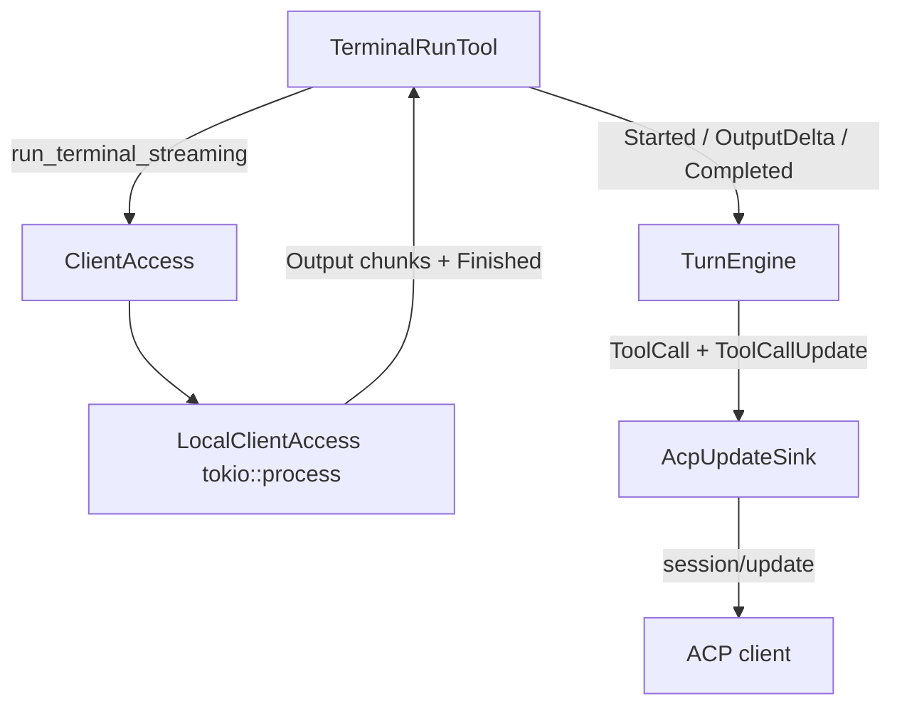

# Progress indication: rich tool calls & streaming terminal output

ACP has no dedicated `progress` RPC. Progress is expressed through the stream of
`session/update` notifications during a prompt turn. This document covers two
enhancements to that stream:

1. **Rich `ToolCall` updates** — every tool call now carries a human-readable
   `title`, a `kind` (icon/UI hint), affected file `locations`
   ("follow-along"), the `raw_input` arguments, and (on completion) the
   `raw_output` payload.
2. **Streaming terminal output** — `terminal_run` streams its stdout/stderr
   line-by-line as it is produced, instead of returning one blob after the
   command exits.

## 1. Rich tool calls

### Provider-agnostic model (`agent-core`)
`agent-core` gained two protocol-independent types in `sink.rs`:

- `ToolKind` — `Read | Edit | Delete | Move | Search | Execute | Think | Fetch | Other`.
- `ToolCallLocation { path, line }`.

`EngineOutput::ToolCall` now includes `title`, `kind`, `locations`, and
`raw_input`; `EngineOutput::ToolCallUpdate` includes `raw_output`.

### Tool self-description
The `Tool` trait gained three default methods so a tool can describe a specific
invocation without the engine knowing tool internals:

```rust
fn kind(&self) -> ToolKind { ToolKind::Other }
fn title(&self, _args: &serde_json::Value) -> Option<String> { None }
fn locations(&self, _args: &serde_json::Value) -> Vec<ToolCallLocation> { Vec::new() }
```

Built-in tools override them:

| Tool           | kind    | title              | locations   |
|----------------|---------|--------------------|-------------|
| `fs_read`      | Read    | `Read <path>`      | `[<path>]`  |
| `fs_write`     | Edit    | `Write <path>`     | `[<path>]`  |
| `terminal_run` | Execute | `Run <cmd> <args>` | none        |

### Engine & ACP mapping
`TurnEngine::dispatch_tool` looks the tool up before emitting the initial
pending `ToolCall`, fills `title`/`kind`/`locations` (falling back to the tool
name when unknown), and attaches `raw_input`. On completion, the tool's JSON
result is forwarded as `raw_output`. `AcpUpdateSink` maps these onto the ACP
`ToolCall`/`ToolCallUpdateFields` builders (`map_kind`, `map_location`).

## 2. Streaming terminal output

### `ClientAccess` seam
`ClientAccess` gained a streaming method with a safe default:

```rust
async fn run_terminal_streaming(&self, command: &str, args: &[String])
    -> Result<BoxStream<'static, TerminalChunk>>;
```

`TerminalChunk` is `Output(String)` deltas followed by exactly one
`Finished(TerminalOutcome)`. The default implementation wraps `run_terminal`
(one output chunk + finished), so existing/fake clients keep working unchanged.

`LocalClientAccess` (in both `acp-agent` and `cli-agent`) overrides it: it
spawns the process with piped stdout/stderr (`tokio::process`), reads lines as
they arrive (stdout then stderr), forwards each as a `TerminalChunk::Output`,
and emits a final `Finished` with the exit code/signal. Output is capped at 64
KiB; overflow marks the outcome truncated.

### Tool wiring
`TerminalRunTool::call` now returns a live stream: `Started`, then each
`TerminalChunk::Output` mapped to `ToolEvent::OutputDelta`, then the `Finished`
chunk mapped to `Completed`/`Failed`. The engine already forwards each
`OutputDelta` as an incremental `ToolCallUpdate`, so the client sees a live log.

## Flow



## Not covered here
`UsageUpdate` (token/cost reporting) and translating orchestration steps into
`Plan` updates remain future work; this change is scoped to rich tool calls and
streaming terminal output.
